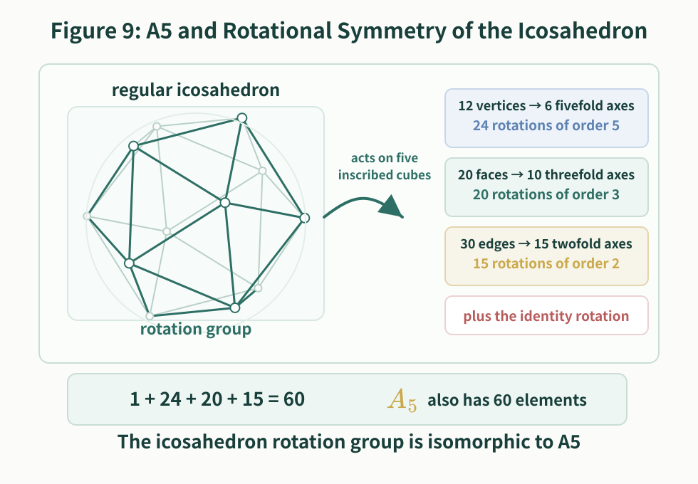
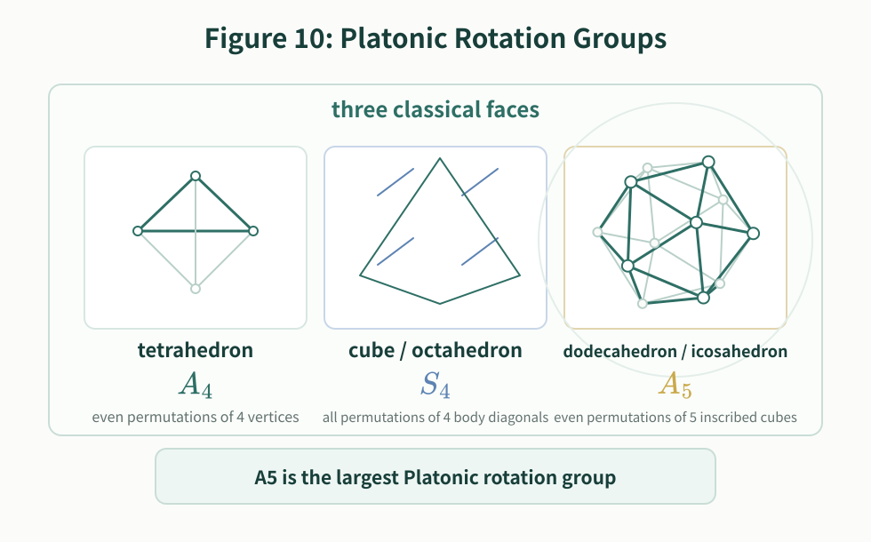
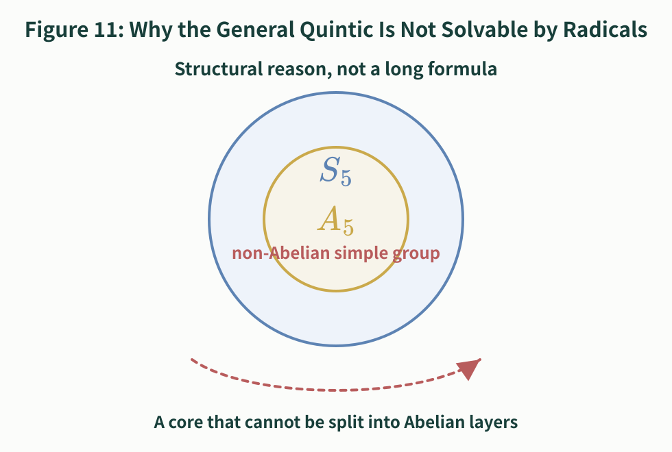

# Things About Solving Equations

**-- On Radical Solutions of Low-Degree Equations and the Theoretical Boundary and Decision Methods for Quintics**

Author: GitHub @mathwo  
Date: October 9, 2026  
Version: 1.0.4

A popular exposition that begins with concrete methods for solving low-degree equations and then moves toward **Galois theory**, the theoretical boundary at the quintic, and practical decision methods for concrete quintic equations.

This article follows the plain question "how do we solve equations?" The first half gives a fairly complete account of **radical solution methods** for quadratic, cubic, and quartic equations. The quadratic formula can be derived by the "average $\pm$ offset" method; cubic equations lead to Cardano's formula, the triple-angle substitution, and a substitution by a quadratic-over-linear rational function; quartic equations are handled by Ferrari's method, which reduces the problem to an auxiliary cubic and two quadratic equations.

The second half turns to quintic equations. Here the point is not to keep looking for a longer formula, but to explain why the general quintic has no radical formula that works in all cases. To do this, we start from **groups**, **fields**, **factorization**, and **permutations of roots**, then discuss **radical extensions** and splitting fields, and finally introduce **Galois groups**, **normal subgroup chains**, and solvable groups. This explains the structural reason behind the Abel-Ruffini theorem. We then give a practical decision route: for a specific quintic equation, how can one use factorization, reduction modulo primes, cycle types, and solvability of the Galois group to decide whether it is solvable by radicals?

The phrase "theoretical boundary" refers to the following fact: radical solution remains a universal method for equations of degree at most four, but from degree five onward the general equation no longer has a universal radical formula. This boundary does not mean that every quintic is unsolvable by radicals. It means that a single radical formula applying to all quintics does not exist. Beyond the boundary there are still special solvable quintics; the key question is whether the concrete equation has a solvable Galois group.

## 1. Low-Degree Equations and Vieta's Formulas

The quadratic formula is familiar. For

$$
ax^2+bx+c=0
$$

one substitutes the coefficients and uses only arithmetic operations and a square root:

$$
x=\frac{-b\pm\sqrt{b^2-4ac}}{2a}
$$

There is also an old and very intuitive way to derive this formula. Po-Shen Loh has recently reorganized this idea: first divide by $a$ and write the equation as $x^2+Bx+C=0$, where $B=\dfrac ba$ and $C=\dfrac ca$. If the two roots are $r$ and $s$, then $r+s=-B$ and $rs=C$. When the sum of two numbers is known, the natural thing is to start from their average. Their average is $-\dfrac B2$, so they can be written as $-\dfrac B2+u$ and $-\dfrac B2-u$. Now use the product condition: $\left(-\dfrac B2+u\right)\left(-\dfrac B2-u\right)=\dfrac{B^2}{4}-u^2=C$, so $u^2=\dfrac{B^2}{4}-C$. Thus the two roots are $-\dfrac B2\pm\sqrt{\dfrac{B^2}{4}-C}$; substituting back $B=\dfrac ba$ and $C=\dfrac ca$ gives the usual quadratic formula. The advantage of this method is that one does not begin by memorizing a formula. One begins by writing "two numbers with known sum" as "average $\pm$ offset."

There are also formulas by radicals for cubic and quartic equations. The formulas are much more complicated, but in principle they still use only addition, subtraction, multiplication, division, and extraction of roots.

The history of the cubic formula is rather dramatic. In the early sixteenth century, the Italian mathematician Scipione del Ferro had already found a method for solving certain cubic equations, but he did not publish it. Later, Niccolò Tartaglia independently mastered a similar method and used it in mathematical contests. Gerolamo Cardano learned the method from Tartaglia, and after confirming that del Ferro had discovered it earlier, organized the solution of cubic equations and published it in *Ars Magna* in 1545. Thus what is now called **Cardano's formula** was not created by Cardano alone out of nowhere. It was the result of work pushed forward by del Ferro, Tartaglia, Cardano, and others; it bears Cardano's name mainly because Cardano was the first to publish it systematically.

The usual solution of a cubic first uses a substitution to remove the quadratic term. The resulting form is called the **depressed cubic**:

$$
y^3+py+q=0
$$

**Cardano's formula** can be written as follows. Let

$$
\Delta=\left(\frac q2\right)^2+\left(\frac p3\right)^3
$$

and take two cube roots

$$
\begin{aligned}
A&=\sqrt[3]{-\frac q2+\sqrt{\left(\frac q2\right)^2+\left(\frac p3\right)^3}}=\sqrt[3]{-\frac q2+\sqrt{\Delta}}
\end{aligned}
$$

$$
\begin{aligned}
B&=\sqrt[3]{-\frac q2-\sqrt{\left(\frac q2\right)^2+\left(\frac p3\right)^3}}=\sqrt[3]{-\frac q2-\sqrt{\Delta}}
\end{aligned}
$$

To get all three roots one also introduces a primitive cube root of unity, $\omega=\dfrac{-1+i\sqrt3}{2}$. Then $\omega^2=\dfrac{-1-i\sqrt3}{2}=\overline{\omega}$, $\omega^3=1$, and $\omega\ne1$.

There is a small technical point here: a cube root has three possible values, so the choices of $A$ and $B$ must be paired correctly. In other words, one must choose the pair satisfying $AB=-\dfrac p3$ . With that choice, the three roots of the depressed cubic are $y_1=A+B$ , $y_2=\omega A+\omega^2B$ , and $y_3=\omega^2A+\omega B$ .

This formula is already much more complicated than the quadratic formula. It uses not only square roots, but also cube roots, and complex numbers and roots of unity appear naturally. The point is not to memorize the formula itself. The important thing is that it still uses only arithmetic operations and extraction of roots, so it is still a **solution by radicals**.

The first substitution method for solving a cubic by radicals uses the trigonometric triple-angle identity.

Starting from the general cubic $ax^3+bx^2+cx+d=0$ (where $a\ne0$), set

$$
\begin{aligned}
p&=\frac ca-\frac{b^2}{3a^2}\\
q&=\frac{2b^3}{27a^3}-\frac{bc}{3a^2}+\frac da\\
x&=y-\frac b{3a}
\end{aligned}
$$

This removes the quadratic term, and the equation becomes $y^3+py+q=0$ .

If $p=0$ , the equation has already reduced to $y^3+q=0$ and can be solved directly by taking a cube root. Now assume $p\ne0$ .

Set $k^2=-\dfrac p3$, $r=\dfrac q{k^3}$, and $z=\dfrac yk$ . Then $y=kz$ and the equation becomes $z^3-3z+r=0$ .

Now use the identity $(2\sin\theta)^3-3(2\sin\theta)=-2\sin 3\theta$ , and set $z=2\sin\theta$, $r=2\sin\phi$, and $\phi=\arcsin\dfrac r2$ .

Here $\theta$ and $\phi$ may be understood over the complex numbers. Substitution gives $-2\sin 3\theta+2\sin\phi=0$ , that is, $\sin 3\theta=\sin\phi$ .

Take $\theta_j=\dfrac{\phi+2j\pi}{3}$ , where $j=0,1,2$ . Then the three solutions for $z$ are $z_j=2\sin\dfrac{\phi+2j\pi}{3}$ .

Returning to $y$ and $x$ , we get $y_j=2k\sin\dfrac{\phi+2j\pi}{3}$ and $x_j=2k\sin\dfrac{\phi+2j\pi}{3}-\dfrac b{3a}$ , where $j=0,1,2$ .

The purpose of this derivation is not to make the reader memorize yet another cubic formula. It shows that cubic substitutions naturally lead to a "trisecting an angle" structure. The three choices of angle correspond to the three roots, foreshadowing a theme that will return throughout the article: root-finding is also about which choices may be interchanged.

The second method: after reducing to the depressed cubic, directly use a substitution by a **quadratic-over-linear rational function** of the form $\displaystyle f(x)=ax-\frac{b}{x}$ .

Still start from $y^3+py+q=0$ . Let $y=z-\dfrac p{3z}$ .

The point of this substitution is that the linear term and the reciprocal term cancel after expansion. Substituting it into $y^3+py+q=0$ gives

$$
\begin{aligned}
0&=\left(z-\frac p{3z}\right)^3
  +p\left(z-\frac p{3z}\right)+q\\
&=z^3-pz+\frac{p^2}{3z}-\frac{p^3}{27z^3}
  +pz-\frac{p^2}{3z}+q\\
&=z^3-\frac{p^3}{27z^3}+q
\end{aligned}
$$

Multiplying both sides by $z^3$ gives $z^6+qz^3-\dfrac{p^3}{27}=0$ .

This is a quadratic equation in $z^3$ , so

$$
z^3=-\frac q2\pm\sqrt{\left(\frac q2\right)^2+\left(\frac p3\right)^3}
$$

Set

$$
\begin{aligned}
u&=\sqrt[3]{-\frac q2+\sqrt{\left(\frac q2\right)^2+\left(\frac p3\right)^3}}\\
v&=\sqrt[3]{-\frac q2-\sqrt{\left(\frac q2\right)^2+\left(\frac p3\right)^3}}
\end{aligned}
$$

Choose the pair of cube roots satisfying $uv=-\dfrac p3$ . Then $y=u+v$ gives one root of the depressed cubic.

Using the cube root of unity $\omega$ introduced above, the three roots of the original cubic are

$$
\begin{aligned}
x_1&=u+v-\frac b{3a}\\
x_2&=\omega u+\omega^2v-\frac b{3a}\\
x_3&=\omega^2u+\omega v-\frac b{3a}
\end{aligned}
$$

Seen this way, Cardano's formula does not appear out of nowhere. It comes from a purposeful substitution. That substitution turns the cubic into a quadratic equation in $z^3$ : first take a square root, then a cube root, and finally use cube roots of unity to account for all three choices.

Now the word **radical** should be made precise. Here a radical is not a root of an equation in general, but an expression built using root signs, such as $\sqrt2$, $\sqrt[3]{5}$, or $\sqrt{b^2-4ac}$. A formula by radicals is a formula made from the coefficients by finitely many additions, subtractions, multiplications, divisions, and extractions of roots.

The quartic equation goes one step further. The key idea of **Ferrari's method** is to turn the quartic into a difference of two squares, and then split it into two quadratic equations.

Consider the monic quartic $x^4+ax^3+bx^2+cx+d=0$ . If the original leading coefficient is not $1$ , divide by it first. Set $x=y-\dfrac a4$ . This removes the cubic term. This step may be regarded as the simplest kind of **Tschirnhaus transformation**: one changes the old variable into a new variable so that the resulting equation has a simpler form. The earlier substitution $x=y-\dfrac b{3a}$ in the cubic case, which removes the quadratic term, is the same idea in its most elementary form. More generally, a Tschirnhaus transformation makes the new roots polynomial or rational functions of the old roots, with the aim of eliminating selected terms and reducing the equation to a more useful standard form.

This gives the depressed quartic

$$
y^4+py^2+qy+r=0
$$

where

$$
\begin{aligned}
p&=b-\frac{3a^2}{8}\\
q&=c-\frac{ab}{2}+\frac{a^3}{8}\\
r&=d-\frac{ac}{4}+\frac{a^2b}{16}-\frac{3a^4}{256}
\end{aligned}
$$

First complete part of the square:

$$
\left(y^2+\frac p2\right)^2+qy+\left(r-\frac{p^2}{4}\right)=0
$$

Now introduce an auxiliary quantity $\alpha$ and rewrite the equation as

$$
\left(y^2+\frac p2+\alpha\right)^2-
\left[
2\alpha\left(y^2+\frac p2\right)+\alpha^2-qy+\frac{p^2}{4}-r
\right]=0
$$

The expression inside the brackets is a quadratic polynomial in $y$ :

$$
2\alpha y^2-qy+\left(\alpha p+\alpha^2+\frac{p^2}{4}-r\right)
$$

If this quadratic is also a perfect square, then the whole quartic becomes "a square minus a square," and it can be factored immediately. A quadratic is a perfect square exactly when its discriminant is zero. Therefore we require

$$
q^2-8\alpha\left(\alpha p+\alpha^2+\frac{p^2}{4}-r\right)=0
$$

This is a cubic equation for $\alpha$ , equivalently

$$
\alpha^3+p\alpha^2+\left(\frac{p^2}{4}-r\right)\alpha-\frac{q^2}{8}=0
$$

This auxiliary cubic can be solved by the cubic method already discussed. After choosing a suitable root $\alpha$ , the bracketed quadratic becomes a perfect square:

$$
\begin{aligned}
2\alpha y^2-qy+\left(\alpha p+\alpha^2+\frac{p^2}{4}-r\right)
&=\left(\sqrt{2\alpha}\,y-\frac{q}{2\sqrt{2\alpha}}\right)^2
\end{aligned}
$$

Thus the depressed quartic becomes

$$
\begin{aligned}
\left(y^2+\frac p2+\alpha\right)^2
&-\left(\sqrt{2\alpha}\,y-\frac{q}{2\sqrt{2\alpha}}\right)^2=0
\end{aligned}
$$

that is,

$$
\left(y^2+\frac p2+\alpha-\sqrt{2\alpha}\,y+\frac{q}{2\sqrt{2\alpha}}\right)\cdot\left(y^2+\frac p2+\alpha+\sqrt{2\alpha}\,y-\frac{q}{2\sqrt{2\alpha}}\right)=0
$$

The original quartic has now been split into two quadratic equations. Solve those two quadratics and then return to the original variable by $x=y-\dfrac a4$ . If $q=0$ , the depressed quartic is already a quadratic equation in $y^2$ , so one may solve for $y^2$ first and then take square roots.

So Ferrari's method has the structure: reduce the quartic to a form with no cubic term, solve an auxiliary cubic to complete the square, and finally split the quartic into two quadratics. This is why quartic equations can still be solved by radicals.

This turn introduces the protagonists of the story: two young geniuses. **Niels Henrik Abel** (1802--1829) was a Norwegian mathematician. At an exceptionally young age, he proved that the general quintic equation has no universal formula by radicals; this is the Abel part of what is now called the Abel-Ruffini theorem. Abel lived in poverty and died at the age of twenty-six, but his work deeply influenced algebraic equations, elliptic functions, and Abelian functions. **Évariste Galois** (1811--1832) was a French mathematician. He died in a duel at the age of twenty; yet in his very short life he did not search for a still longer quintic formula. Instead, he organized the permissible permutations of the roots into a group and turned the question "is this equation solvable by radicals?" into the question "is this group solvable?" The Galois groups and solvable groups discussed below follow this idea.

It was natural to ask whether the general quintic

$$
x^5+a_4x^4+a_3x^3+a_2x^2+a_1x+a_0=0
$$

also has such a universal formula.

The answer is no. But the reason is not that the formula is merely too long or that nobody has found it. The reason is structural.

Let the five roots be

$$
x_1,x_2,x_3,x_4,x_5
$$

By **Vieta's formulas**, these roots satisfy relations determined by the coefficients:

$$
x_1+x_2+x_3+x_4+x_5=-a_4
$$

$$
\sum_{i\lt j}x_ix_j=a_3
$$

$$
\sum_{i\lt j\lt k}x_ix_jx_k=-a_2
$$

$$
\sum_{i\lt j\lt k\lt \ell}x_ix_jx_kx_\ell=a_1
$$

$$
x_1x_2x_3x_4x_5=-a_0
$$

These relations are symmetric. If the roots are merely renamed, the sums and products above do not change. However, one must be careful: the fact that the Vieta relations are symmetric does not mean that the roots are always freely interchangeable.

For example, consider the integer polynomial

$$
f(x)=(x-1)(x^2-3)(x^2+2)
$$

Its roots are $1$, $\sqrt3$, $-\sqrt3$, $\sqrt{-2}$, $-\sqrt{-2}$ .

Over the base field $\mathbb Q$, the rational root $1$ is already singled out. The two roots $\sqrt3$ and $-\sqrt3$ both come from the irreducible factor $x^2-3$ and satisfy the same $\mathbb Q$-coefficient equation $x^2-3=0$ ; similarly, $\sqrt{-2}$ and $-\sqrt{-2}$ both come from $x^2+2$ . Roots may be interchanged inside a pair, but they cannot be mixed across different factors.

<figure>
  
  <figcaption>Figure 1. In this quintic, the rational root, the real irrational pair, and the conjugate complex pair behave as three stable packets over $\mathbb Q$.</figcaption>
</figure>

This is the first hint of the Galois-theoretic idea: solving an equation means adding enough information to distinguish roots that were previously indistinguishable.

## 2. Fields and Base Fields

A **field** is a number system in which addition, subtraction, multiplication, and division by nonzero elements all make sense. The rational numbers $\mathbb Q$, the real numbers $\mathbb R$, and the complex numbers $\mathbb C$ are the standard examples.

The field from which the coefficients are taken is the **base field**. If an equation has rational coefficients, we usually begin with $F=\mathbb Q$. A number not in $F$ is not yet visible from the perspective of $F$, even if it exists as a complex number.

Thus $\sqrt2\notin\mathbb Q$. If the base field is $\mathbb Q$, then $\sqrt2$ has not yet been named by the field. Once we enlarge the field to $\mathbb Q(\sqrt2)$, that number is now part of the allowed number system.

One can think of a larger field as a place where more information is visible. Over $\mathbb Q$, the two roots of $x^2-2$ look symmetric. Over $\mathbb Q(\sqrt2)$, the root $\sqrt2$ is already singled out, and the symmetry is broken.

## 3. Splitting Fields

A polynomial is easiest to study when all of its roots are available. The smallest field containing the base field and all roots of the polynomial is called its **splitting field**.

For the quintic $f(x)=(x-1)(x^2-3)(x^2+2)$ ,

the rational root $1$ is already in $\mathbb Q$. If we adjoin $\sqrt3$, then both real irrational roots $\sqrt3$ and $-\sqrt3$ become visible. But the complex pair $\sqrt{-2}$ and $-\sqrt{-2}$ is still missing.

To make the polynomial split completely, we must adjoin both $\sqrt3$ and $\sqrt{-2}$. Thus the splitting field over $\mathbb Q$ is $\mathbb Q(\sqrt3,\sqrt{-2})$ .

In this field, $f(x)=(x-1)(x-\sqrt3)(x+\sqrt3)(x-\sqrt{-2})(x+\sqrt{-2})$ .

<figure>
  
  <figcaption>Figure 2. The splitting field is the smallest field in which all five roots of the quintic are present.</figcaption>
</figure>

The phrase "splitting field" is literal: it is the field in which the polynomial splits into linear factors.

## 4. Isomorphisms of Splitting Fields

The next idea is **isomorphism**. An isomorphism between fields is not an arbitrary pairing of elements. It is a bijection that preserves addition and multiplication:

$$
\varphi(x+y)=\varphi(x)+\varphi(y),\qquad
\varphi(xy)=\varphi(x)\varphi(y)
$$

Because subtraction and division can be expressed in terms of addition and multiplication, these operations are preserved as well.

<figure>
  
  <figcaption>Figure 3. An isomorphism is not a random matching of elements; it transports the additive and multiplicative structure of one field into another.</figcaption>
</figure>

Suppose two splitting fields $K$ and $K'$ arise from the same polynomial over the same base field $F$. If $\alpha$ is a root in $K$, and $\alpha'$ is the corresponding root in $K'$, then an isomorphism may send

$$
\alpha\mapsto\alpha',\qquad \beta\mapsto\beta'
$$

but it must preserve all algebraic relations with coefficients in $F$. In particular, every element $a\in F$ must be fixed:

$$
\varphi(a)=a
$$

Such maps are called **$F$-isomorphisms**: they preserve the field structure and leave the base field fixed.

<figure>
  
  <figcaption>Figure 4. Two splitting fields may not be literally the same set, but they can be structurally the same over the fixed base field.</figcaption>
</figure>

This viewpoint lets us talk about the symmetries of the roots without depending on how the roots have been represented.

## 5. The Galois Group

Let $K$ be the splitting field of a polynomial over a base field $F$. The **Galois group** of $K/F$, denoted

$$
\mathrm{Gal}(K/F)
$$

is the group of all field automorphisms of $K$ that fix every element of $F$.

An automorphism is an isomorphism from $K$ to itself. It may move roots around, but it is not allowed to move the coefficients in the base field.

For the polynomial

$$
f(x)=(x-1)(x^2-3)(x^2+2)
$$

the splitting field over $\mathbb Q$ is

$$
K=\mathbb Q(\sqrt3,\sqrt{-2})
$$

An automorphism fixing $\mathbb Q$ must send $\sqrt3$ to either $\sqrt3$ or $-\sqrt3$, and must send $\sqrt{-2}$ to either $\sqrt{-2}$ or $-\sqrt{-2}$. These two choices are independent. The rational root $1$ is fixed.

Thus

$$
\mathrm{Gal}(K/\mathbb Q)\cong C_2\times C_2
$$

and this group has four elements.

<figure>
  
  <figcaption>Figure 5. In this example, the rational root is fixed, while the two quadratic pairs of roots may be interchanged independently.</figcaption>
</figure>

Notice the key point: a Galois group does not record every imaginable permutation of roots. It records only those permutations that come from structure-preserving automorphisms of the splitting field.

## 6. Subgroups and Intermediate Fields

The **Fundamental Theorem of Galois Theory** says, roughly, that intermediate fields correspond to subgroups of the Galois group.

Suppose

$$
F\subset B\subset K
$$

The intermediate field $B$ sits between the base field $F$ and the splitting field $K$. To this field one associates a subgroup

$$
G_B=\{\sigma\in\mathrm{Gal}(K/F):\sigma(b)=b\text{ for every }b\in B\}
$$

In words: $G_B$ consists of the automorphisms that fix every element of $B$.

This gives a reversal of direction:

$$
F\subset B\subset K
$$

corresponds to

$$
\mathrm{Gal}(K/F)\supset G_B\supset\{e\}
$$

The larger the intermediate field, the more elements it asks automorphisms to fix, so the smaller the corresponding subgroup becomes.

In the example $K=\mathbb Q(\sqrt3,\sqrt{-2})$, write $a$ for the automorphism that interchanges $\sqrt3$ and $-\sqrt3$, and $b$ for the automorphism that interchanges $\sqrt{-2}$ and $-\sqrt{-2}$. Then

$$
G=\mathrm{Gal}(K/\mathbb Q)=\{e,a,b,ab\}
$$

The top field $K$ corresponds to the trivial subgroup $\{e\}$, while the base field $\mathbb Q$ corresponds to the whole group $G$. The three quadratic intermediate fields correspond to the three order-two subgroups:

$$
\mathbb Q(\sqrt3)\longleftrightarrow \{e,b\},\qquad
\mathbb Q(\sqrt{-2})\longleftrightarrow \{e,a\},\qquad
\mathbb Q(\sqrt{-6})\longleftrightarrow \{e,ab\}
$$

<figure>
  
  <figcaption>Figure 6. Larger fields correspond to smaller fixed subgroups; in this example the correspondence can be drawn explicitly.</figcaption>
</figure>

There is an especially important condition here. If an intermediate field $B$ is itself a splitting field over $F$, then the corresponding subgroup is a **normal subgroup**. Conversely, normal subgroups correspond to intermediate fields that behave well over the base field.

If $N\triangleleft G$, one can form the **quotient group**

$$
G/N
$$

The elements of $G/N$ are cosets, not single group elements:

$$
gN=\{gn:n\in N\}
$$

The multiplication rule is

$$
(gN)(hN)=(gh)N
$$

This is well defined precisely because $N$ is normal.

Normal subgroups and quotient groups are the mechanism by which a complicated group can be decomposed into simpler pieces.

## 7. Abelian Groups and Solvable Groups

A group $G$ is called **solvable** if it can be reduced to the trivial group through a chain of normal subgroups in which every quotient is Abelian. One common form is

$$
\{e\}=G_s\triangleleft G_{s-1}\triangleleft\cdots\triangleleft G_1\triangleleft G_0=G
$$

and each quotient

$$
G_{i-1}/G_i
$$

must be an Abelian group.

<figure>
  
  <figcaption>Figure 7. A normal subgroup chain decomposes a group into successive sections; each section is described by a quotient of neighboring groups.</figcaption>
</figure>

An **Abelian group** is a group whose operation is commutative:

$$
ab=ba
$$

The integers under addition form an Abelian group, because

$$
a+b=b+a
$$

The symmetric group $S_3$, the group of all permutations of three objects, is not Abelian. The order in which two permutations are composed can matter.

Why do Abelian groups appear in radical solutions? Because solving by radicals allows only one root extraction at each step. The basic symmetry introduced by adjoining an $n$-th root is controlled by multiplication by $n$-th roots of unity. That symmetry is essentially cyclic, and cyclic groups are Abelian. In other words, each radical step usually corresponds, in group-theoretic language, to one Abelian quotient.

This is why the word "solvable" is used. A solvable group is not a group that has merely been "computed"; it is a group whose complexity can be reduced, along a normal subgroup chain, to Abelian quotient pieces. Since radical extraction handles precisely this kind of Abelian symmetry, solvable groups become the group-theoretic shadow of solution by radicals.

## 8. Radical Solvability Is Equivalent to a Solvable Galois Group, and Other Viewpoints

Now we give the proof framework. To avoid technical side issues, we first state it in the most common field-theoretic setting: the base field has **characteristic** $0$, as $\mathbb Q$, $\mathbb R$, and $\mathbb C$ do. Characteristic $0$ means that adding $1$ to itself any finite number of times never suddenly gives $0$. We also temporarily assume that the necessary roots of unity have been adjoined. Artin's lectures then explain how this roots-of-unity assumption can be removed by further theorems, so the final conclusion does not depend on it.

The central theorem can be stated as follows:

> A polynomial is solvable by radicals if and only if its Galois group is a solvable group.

Here is the intuitive content of the two directions.

**First: solvable by radicals $\Rightarrow$ solvable Galois group**

If the roots can be obtained by radicals, then the splitting field sits inside a chain obtained by repeatedly adjoining radicals. Each radical step has a relatively simple Galois-theoretic effect: it contributes an Abelian quotient. Translating the whole chain through the Galois correspondence gives a normal subgroup chain with Abelian quotients. Therefore the Galois group is solvable.

**Second: solvable Galois group $\Rightarrow$ solvable by radicals**

If the Galois group has such a normal subgroup chain, the Fundamental Theorem of Galois Theory converts it back into a chain of intermediate fields. When the quotients are Abelian, the corresponding field extensions can be constructed using radicals, after adjoining the necessary roots of unity. Thus the roots can be expressed by radicals.

<figure>
  
  <figcaption>Figure 8. A radical solution gives a tower of field extensions; Galois theory translates that tower into normal subgroups and Abelian quotient groups.</figcaption>
</figure>

**Supplementary Viewpoint: Monodromy Groups and Moving Around the Roots**

Besides the algebraic language of Galois theory, one can also analyze radical solvability of higher-degree algebraic equations from the viewpoint of complex analysis and topology. V.B. Alekseev's *Abel's Theorem in Problems and Solutions*, based on lectures by V.I. Arnold, follows this route: instead of beginning with splitting fields and field automorphisms, it regards the roots of an equation as **multi-valued functions** of the coefficients or of a parameter.

It is important to say that this was not Abel's original method of proof. The Arnold-Alekseev argument is a modern topological proof of Abel's theorem. Abel's original proof was mainly algebraic; **monodromy groups**, Riemann surfaces, and branched coverings are later language for explaining the same kind of root permutation behavior.

Historically, Ruffini had already made an important attempt along a similar line. In 1824, not long after Ruffini's death, the young Norwegian mathematician Niels Henrik Abel published, at his own expense, a very short pamphlet proving that the general quintic has no formula by radicals. Because the pamphlet was extremely compressed, many details were stated very tersely. But the core idea is clear: argue by contradiction, assume that one root of the general quintic can be expressed from the coefficients by finitely many arithmetic operations and radicals, and then study how many distinct values such a radical expression can take when the five roots are permuted in all possible ways.

More concretely, suppose a quintic has five distinct roots. Since the coefficients of the equation are symmetric functions of the five roots, any formula written from the coefficients must preserve the corresponding algebraic relations when the roots are relabeled. Abel proved that, if a root could really be expressed by radicals, then after peeling away the radical tower step by step, some intermediate expressions would have forms similar to

$$
r=p+p_1R^{1/5}+p_2R^{2/5}+p_3R^{3/5}+p_4R^{4/5}
$$

where $p,p_1,p_2,p_3,p_4$ are rational expressions built from quantities already obtained, and $R$ can itself be expanded in the same way. The question is then transformed into this one: as functions of the five roots, how many distinct values can these expressions take under all $5!=120$ permutations of the roots? Abel's key analysis is that a tower of radicals imposes strict restrictions on these possible value counts; the value structure needed by the five roots of a general quintic is incompatible with those restrictions. Thus the assumption that a universal radical formula exists leads to a contradiction.

So Abel's own proof was not a proof by drawing Riemann surfaces or by discussing monodromy groups. He was tracking, algebraically, how radical expressions behave under permutations of the roots. Modern Galois theory organizes this idea into the criterion "the Galois group is solvable"; the Arnold-Alekseev topological proof translates the same kind of interchange behavior into "how roots are permuted after analytic continuation around branch points." The languages are different, but they grasp the same fact: radical formulas can produce only finite layers of solvable permutation structure, while the general quintic requires a permutation structure that is too complex.

For example, Alekseev's book focuses on the family of quintic equations

$$
3w^5-25w^3+60w-z=0
$$

Here $z$ is treated as a complex parameter, and $w$ is a root varying with $z$. For a general value of $z$, the equation has five roots; in other words, $w(z)$ is a five-valued function. As $z$ moves along a closed path in the complex plane, each root can be followed continuously. But if $z$ winds around certain **branch points** and returns to where it started, the five roots need not return to their original labels; they may be permuted.

The permutations produced by "going once around a branch point" form the monodromy group of this multi-valued function. In the setting of this article, the **monodromy group** can be defined as follows: choose a parameter value that is not a branch point, and label the local roots there; let the parameter travel along closed curves that avoid the branch points and return to the starting value; while doing so, continue each root analytically. At the end of such a loop, the root set has undergone a permutation. The group formed by all permutations produced in this way is the monodromy group of the multi-valued function. Geometrically, one may imagine the five roots as five sheets of a **Riemann surface**. Each sheet corresponds to one local root. When the parameter $z$ winds around a branch point, the path may carry us from one sheet to another. The monodromy group records precisely how the sheets are interchanged after such winding.

Radical functions themselves also have branches. For example, after $\sqrt[n]{z}$ winds once around $0$, it is multiplied by an $n$-th root of unity. This basic branching behavior corresponds to a cyclic group, and cyclic groups are Abelian. Finite combinations of arithmetic operations, compositions, and radical extractions can only build these cyclic branching structures layer by layer. Therefore a multi-valued function expressible by radicals must have a solvable monodromy group. This is the key point in the Arnold-Alekseev route.

Conversely, the root function of the quintic family above has five sheets. By analyzing its branch points and the way the sheets of the Riemann surface are connected, the book proves that the permutations obtained by winding around these branch points generate the whole group $S_5$. Since $S_5$ is not solvable, this root function cannot be expressed by radicals. Moreover, if the general quintic really had a universal formula by radicals, then specializing the coefficients to this family would give a radical expression for this root function, contradicting the fact that its monodromy group is $S_5$. Therefore the general quintic has no universal radical formula.

This viewpoint and Galois theory are not two contradictory theories. For algebraic functions, the monodromy group and the corresponding Galois group describe, in a natural sense, the same root-interchange structure. The difference is one of language: Galois theory says that radical solution fails because the group of root permutations preserving algebraic relations is too complicated; the monodromy viewpoint says that radical solution fails because the branching topology of the roots as multi-valued functions is too complicated. The former emphasizes automorphisms that fix the base field; the latter emphasizes how roots are interchanged after analytic continuation around branch points. Both descriptions lead to the same test: if this permutation structure is not solvable, then no radical formula exists.

## 9. Why the General Quintic Is Not Solvable by Radicals, and the Decision Strategy

First, why does the general quintic have no formula by radicals? In the application part of Artin's lectures, one proves that the Galois group of the **general equation of degree $n$** is the **symmetric group** $S_n$ on the $n$ roots.

Here "the general equation of degree $n$" does not mean one specific equation. It means the universal degree-$n$ equation whose coefficients are independent and have no extra special relations. One may think of it as the least special degree-$n$ equation.

The group $S_n$ should be made explicit. Suppose the $n$ roots are $r_1,r_2,\ldots,r_n$. Then $S_n$ is the group of all permutations of this root set. "All" means that any one-to-one relabeling of the roots is included. For example, in $S_5$ the permutations $(1\,2)$, $(1\,2\,3)$, and $(1\,2\,3\,4\,5)$ all occur.

Here $(1\,2)$ means that $r_1$ and $r_2$ are interchanged while the other roots are fixed. The cycle $(1\,2\,3)$ means $r_1\mapsto r_2$, $r_2\mapsto r_3$, and $r_3\mapsto r_1$, while the other roots are fixed. The group $S_n$ has $n!$ elements, because there are $n!$ ways to relabel $n$ roots.

This also explains the word "cycle." A permutation of the form $(1\,2\,3\,4\,5)$ is called a **5-cycle**. It means $r_1\mapsto r_2$, $r_2\mapsto r_3$, $r_3\mapsto r_4$, $r_4\mapsto r_5$, and $r_5\mapsto r_1$. The five roots move one step at a time and the last one returns to the first. Similarly, $(1\,2\,3)$ is a **3-cycle**. The length of a cycle is the number of elements participating in it.

The reason the general equation has this Galois group comes from **elementary symmetric functions**: the coefficients of the general equation are the elementary symmetric functions of the roots, and any permutation of the roots leaves those symmetric functions unchanged. Thus

$$
\mathrm{Gal}(\text{general equation of degree }n)\cong S_n
$$

On the other hand, $S_n$ is **not solvable** for $n>4$. To see why the failure begins at degree five, start with $S_5$. Inside $S_5$ there is an important subgroup, denoted $A_5$. It consists of all **even permutations** of five objects, and its standard name is the **alternating group on five letters**.

More formally, for any $n>1$, the **alternating group** $A_n$ is the subgroup of the symmetric group $S_n$ consisting of all even permutations:

$$
A_n=\{\sigma\in S_n:\sigma\text{ is even}\}
$$

Equivalently, it is the kernel of the **sign homomorphism**

$$
\operatorname{sgn}:S_n\to\{1,-1\}
$$

Thus

$$
A_n=\ker(\operatorname{sgn})
$$

So $A_n$ is a normal subgroup of $S_n$, has index $2$, and therefore has $\dfrac{n!}{2}$ elements. In this article the important case is $A_5$: the group of all even permutations in $S_5$, with $60$ elements.

What is an even permutation? Any permutation can be decomposed into transpositions, where each transposition swaps just two elements. If the number of transpositions is even, the permutation is called even; if it is odd, the permutation is called odd. The decomposition itself need not be unique, but the parity of the number of transpositions is well defined. For instance, $(1\,2)$ is one transposition, so it is odd and is not in $A_5$. But $(1\,2\,3)=(1\,3)(1\,2)$ is a product of two transpositions, so it is even and lies in $A_5$. Likewise, $(1\,2\,3\,4\,5)=(1\,5)(1\,4)(1\,3)(1\,2)$ is a product of four transpositions, so it is also in $A_5$.

Thus $A_5$ is not a mysterious abstract name. It is the group of all permutations in $S_5$ that can be decomposed into an even number of transpositions. Since $S_5$ has $5!=120$ elements and exactly half of them are even, $A_5$ has $60$ elements.

Even more strikingly, $A_5$ can be seen geometrically: it is the **rotation group of the regular icosahedron**. A regular icosahedron has $12$ vertices, $20$ faces, and $30$ edges. We count only orientation-preserving rotations, not reflections. Around an axis through a pair of opposite vertices, one can rotate by $72^\circ,144^\circ,216^\circ,$ or $288^\circ$; there are $6$ such axes, giving $6\cdot4=24$ rotations of order $5$. Around an axis through a pair of opposite face centers, one can rotate by $120^\circ$ or $240^\circ$; there are $10$ such axes, giving $10\cdot2=20$ rotations of order $3$. Around an axis through a pair of opposite edge midpoints, one can rotate by $180^\circ$; there are $15$ such axes, giving $15$ rotations of order $2$. Together with the identity rotation, the total is

$$
1+24+20+15=60
$$

This is exactly $|A_5|=60$. More deeply, one can see five inscribed cubes inside the icosahedron. Every rotational symmetry permutes these five cubes, hence gives a permutation of five objects. This correspondence respects composition and gives precisely $A_5$. Thus

$$
\operatorname{Rot}(\text{regular icosahedron})\cong A_5
$$

This geometric picture also makes the phrase "non-Abelian" concrete. If one performs two different rotations of an icosahedron in succession, the final orientation usually depends on the order in which the rotations are performed. Thus this rotation group is not Abelian.

This is closely tied to the quintic: the same $A_5$ that appears inside the Galois group of the general quintic is also the rotation group of the icosahedron. Klein's later icosahedral solution of the quintic is built on this geometric form of $A_5$.

<figure>
  
</figure>

The group $A_5$ also has several equivalent "faces." It is not only the group of even permutations of five objects, but also the rotation group of both the regular icosahedron and the regular dodecahedron. These two Platonic solids are dual to each other, so they have the same rotation group. A more everyday geometric cousin is the soccer-ball shape, the truncated icosahedron; its orientation-preserving rotation group is again this $60$-element group. In a more abstract direction, the regular four-dimensional simplex has five vertices. Its full symmetry group is $S_5$, and the orientation-preserving rotations correspond exactly to even permutations, so they form $A_5$.

In a more algebraic language, $A_5$ is also isomorphic to $\mathrm{PSL}(2,5)$. Here $\mathrm{PSL}(2,5)$ means the **projective special linear group** of degree $2$ over the field with five elements. Roughly, start with the finite field $\mathbb F_5=\{0,1,2,3,4\}$ and consider all $2\times2$ matrices with determinant $1$ over this field; they form $\mathrm{SL}(2,5)$. Such a matrix acts by a fractional linear transformation

$$
z\mapsto \frac{az+b}{cz+d}
$$

on the six points of the projective line $\mathbb P^1(\mathbb F_5)=\mathbb F_5\cup\{\infty\}$. Since the matrices $I$ and $-I$ induce the same projective transformation, one quotients by the center $\{\pm I\}$; the resulting group is $\mathrm{PSL}(2,5)$. It has $120/2=60$ elements, and the classical exceptional isomorphism is

$$
\mathrm{PSL}(2,5)\cong A_5
$$

Thus the point is that the same group $A_5$ can be seen as even permutations of five objects, as rotations of the icosahedron, and as fractional linear transformations over a finite field. Klein's later icosahedral solution connects precisely these different faces of the same group.

<figure>
  
</figure>

A **Platonic solid**, or **convex regular polyhedron**, is a convex polyhedron in three-dimensional space satisfying two conditions: every face is a congruent regular polygon, and the same number of faces meet at every vertex. Exactly five solids have this property: the tetrahedron, the cube, the octahedron, the dodecahedron, and the icosahedron.

Here "largest" is not a value judgment, and it does not mean that $A_5$ is the largest finite rotation group in every possible sense. Finite rotation groups in three-dimensional space include two infinite families, the cyclic groups $C_n$ and the dihedral rotation groups $D_n$, where $n$ can grow arbitrarily. Besides these infinite families, there are three exceptional, Platonic types: the tetrahedral type, the cube/octahedron type, and the dodecahedron/icosahedron type.

Among these three Platonic rotation groups, the tetrahedron has rotation group $A_4$, of order $12$; the cube and octahedron are dual to each other and have rotation group $S_4$, of order $24$; the dodecahedron and icosahedron are dual to each other and have rotation group $A_5$, of order $60$. So by the number of rotation operations, $A_5$ is the largest of the Platonic types.

One should also distinguish **pure rotations** from the **full symmetry group**. Here we are discussing orientation-preserving rotations, so the rotation group of the dodecahedron or icosahedron is $A_5$, of order $60$. If reflections and other orientation-reversing symmetries are also included, the full symmetry group has order $120$: one has the $A_5$ rotation symmetries together with an additional order-two orientation-reversing layer.

The structural point is even more important. Although $A_4$ and $S_4$ are already non-Abelian, they are still solvable groups: they can still be decomposed through normal subgroup chains with Abelian quotients. The group $A_5$ is different. It is the smallest non-Abelian simple group: it is not Abelian, and it has no nontrivial normal subgroup through which it could be further broken down. Thus, from the viewpoint of solvability by radicals, the three Platonic rotation groups form a useful ladder: $A_4$ and $S_4$ still belong to the solvable world, while $A_5$ already enters the nonsolvable world. That is the intended meaning of calling it the "largest" Platonic rotation type: it is the Platonic type with both the greatest order and the key non-Abelian simple structure.

The group $A_5$ matters because it has two properties at once.

First, $A_5$ is not Abelian. In other words, some permutations in it do not commute. For example, let

$$
\sigma=(1\,2\,3),\qquad \tau=(1\,3\,4)
$$

Both are 3-cycles, hence both are even and lie in $A_5$. But with the usual convention that compositions are read from right to left, $\sigma\tau=(1\,3\,4\,2)$, while $\tau\sigma=(1\,2\,4\,3)$. The two results are different, so $\sigma\tau\neq\tau\sigma$.

This concretely shows that $A_5$ is not Abelian. By the definition of a solvable group, every quotient appearing in a normal subgroup chain must be Abelian; a quotient that is already an $A_5$-type non-Abelian group is not an acceptable Abelian quotient.

Second, $A_5$ is **simple**: it has no nontrivial normal subgroups. Here "nontrivial" means anything other than $\{e\}$ and the whole group. Without an intermediate normal subgroup, there is no way to keep decomposing this group into smaller Abelian quotient pieces.

Combining these two facts gives the key reason: $A_5$ is not Abelian, and it has no nontrivial normal subgroup through which it can be further decomposed. Therefore $A_5$ cannot be broken into Abelian quotient groups by a normal subgroup chain. Since $A_5$ occurs inside the structure of $S_5$, the group $S_5$ is not solvable.

Before looking at concrete quintic examples, it is useful to spell out the strategy behind the computations. This section turns the preceding theory into a practical decision method. The examples in Section 10 are not trying to "calculate five roots by force"; they ask a more structural question:

Is the Galois group of this equation solvable, or has it already reached one of the nonsolvable types $A_5$ or $S_5$?

The route has several steps.

First, check whether the polynomial already factors over the base field. In this article the base field is usually $\mathbb Q$, so the question is whether the polynomial is reducible in $\mathbb Q[x]$. For a quintic, a nontrivial factorization has type $1+4$ or $2+3$. In either case, each factor has degree at most $4$, so the problem has been reduced to equations that can in principle be handled by the classical formulas.

The genuinely quintic difficulty usually appears for **irreducible quintic polynomials**. Irreducibility means that, from the point of view of $\mathbb Q$, the five roots have not already split into smaller packets. In permutation-group language, the Galois group acts **transitively** on the five roots.

Second, regard the Galois group as a subgroup of $S_5$. Since every Galois automorphism permutes the five roots, the Galois group naturally sits inside the full permutation group $S_5$. The question becomes:

Is this subgroup all of $S_5$, or is it a smaller subgroup?

For an irreducible quintic polynomial, the possible transitive subgroups are quite restricted. Up to isomorphism, the transitive subgroups of $S_5$ are only a short list: the cyclic group $C_5$, the dihedral group $D_5$, the Frobenius group $F_{20}$, the alternating group $A_5$, and the full symmetric group $S_5$. In other words, once the Galois group of an irreducible quintic is viewed as a permutation group on the five roots, it must fall into one of these structural types.

The first three are solvable. The group $C_5$ is just one cycle of order $5$. The group $D_5$ may be viewed as the symmetry group of a regular pentagon: it has a rotation part of order $5$ and a reflection part of order $2$, and structurally it has a chain

$$
D_5\triangleright C_5\triangleright \{e\}
$$

whose successive quotients are $C_2$ and $C_5$, both Abelian. Thus $D_5$ is solvable. The group $F_{20}$ may be thought of as the $20$-element group $C_5\rtimes C_4$: it has a cyclic part of order $5$, acted on by a group of order $4$. It also has a normal subgroup chain with Abelian quotients, so it is solvable. By contrast, $A_5$ and $S_5$ contain the nonsolvable $A_5$-type structure. If the Galois group reaches one of these two cases, the equation is not solvable by radicals.

Thus the later computations usually do not list every Galois automorphism. Instead, they look for enough permutation evidence to rule out the smaller possibilities. For example, if we can show that the Galois group contains cycle types that cannot occur in $C_5$, $D_5$, or $F_{20}$, and also cannot be contained entirely in $A_5$, then the only remaining possibility is $S_5$.

This naturally raises a question: do such polynomials really exist, or are they only theoretical shadows produced by the classification? They are very real, and one can give concrete examples. For instance,

$$
f(x)=x^5-4x+2
$$

is a typical example. It is irreducible over $\mathbb Q$. From the graph of the real function, its derivative

$$
f'(x)=5x^4-4
$$

has two real critical points, so the graph can have at most three real zeros. A direct check of signs shows that it indeed has three real roots; the remaining two roots form one conjugate complex pair. Thus the roots of this quintic have the familiar shape "three real roots plus one conjugate complex pair."

Here one can use a powerful group-theoretic criterion, usually viewed as a consequence of **Jordan's theorem on primitive permutation groups**:

> If $f(x)\in\mathbb Q[x]$ is an irreducible quintic polynomial and has exactly three real roots together with one conjugate complex pair, then its Galois group is $S_5$.

The reason is as follows. The Galois group of an irreducible quintic acts transitively on the five roots; because $5$ is prime, this transitive action is also **primitive**. On the other hand, complex conjugation fixes the three real roots and swaps the two conjugate complex roots, so its action on the five roots is a transposition. Jordan's theorem says that a primitive permutation group containing a transposition must be the full symmetric group. Therefore the Galois group is $S_5$.

Thus the example $x^5-4x+2$ does not require listing all Galois automorphisms. Once we know that it is irreducible and has exactly three real roots, we can conclude that its Galois group is $S_5$, so it is not solvable by radicals. This example connects the abstract group-theoretic decision with the familiar picture of a function graph: the graph shows the real/complex distribution of the roots, complex conjugation gives a concrete transposition, and Jordan's theorem identifies the whole Galois group.

Third, use reduction modulo primes to read off cycle types in the Galois group.

Why reduce modulo primes? Directly seeing the permutations of the five complex roots over $\mathbb Q$ is hard. But if an integer polynomial is reduced modulo a prime $p$, one can factor it in the finite field $\mathbb F_p$. This finite calculation can reveal cycle types in the original Galois group.

A useful simplified form of Dedekind's theorem says the following. Let $f(x)$ be an irreducible integer polynomial of degree $n$. Choose a prime $p$ that does not divide the discriminant of $f$. If the reduction of $f(x)$ modulo $p$ factors in $\mathbb F_p[x]$ into irreducible factors of degrees

$$
d_1,d_2,\ldots,d_k
$$

then the Galois group over $\mathbb Q$ contains a permutation whose cycle lengths are

$$
(d_1,d_2,\ldots,d_k)
$$

For quintics, the most useful patterns are:

| Factorization type modulo $p$ | Cycle type in the Galois group |
|---|---|
| irreducible quintic | 5-cycle $(5)$ |
| linear factor times irreducible quartic | $(1)(4)$ |
| irreducible quadratic times irreducible cubic | $(2)(3)$ |
| two linear factors times irreducible cubic | $(1)(1)(3)$ |
| one linear factor times two irreducible quadratics | $(1)(2)(2)$ |

The intuition is that each irreducible factor modulo $p$ behaves like one cycle-packet of roots; its degree becomes the corresponding cycle length. A quintic that remains irreducible modulo $p$, for instance, gives a 5-cycle.

One avoids primes dividing the discriminant because such primes may create repeated roots modulo $p$. Then the factorization pattern no longer cleanly reflects a permutation type. These are the "bad primes."

Fourth, combine these cycle types with the classification of transitive subgroups of $S_5$.

A very common criterion is this:

If an irreducible quintic has a Galois group containing both a 5-cycle and a permutation of cycle type $(2)(3)$, then its Galois group is the full $S_5$.

The reason is that irreducibility gives transitivity; the 5-cycle shows a full cycle among the five roots; and $(2)(3)$ is an odd permutation of order $6$. The smaller solvable transitive subgroups cannot contain such an element, and $A_5$ contains only even permutations. The remaining possibility is $S_5$.

The discriminant is often used alongside these tests. If the discriminant is a rational square, the Galois group lies inside $A_5$. If it is not a rational square, the Galois group is not contained in $A_5$, so it contains an odd permutation. Thus the discriminant helps distinguish $A_5$ from $S_5$.

Fifth, not every example has to be judged by modular computations. Some special quintics reveal their structure directly. For example, the roots of $x^5-2=0$ have the form $\zeta^j\sqrt[5]{2}$, so the Galois group acts on the indices by $j\mapsto aj+b$ and is a solvable group of order $20$. In Equation 4 below, a substitution $x=u-v$ directly produces radical expressions for the roots.

Thus when analyzing a concrete quintic equation, there are two methods:

The first is to **construct a radical solution directly**. If the roots can be written using arithmetic operations and radicals, possibly after a clever substitution, then the equation is solvable by radicals.

The second is to **recognize that the Galois group has reached a nonsolvable type**. If modular factorizations reveal enough cycle types to force the Galois group to be $A_5$ or $S_5$, then the equation is not solvable by radicals because both groups are nonsolvable.

## 10. Quintic Examples

Now let us look at several quintic equations.

**Equation 1: $x^5-2=0$.**

Let $\alpha=\sqrt[5]{2}$ and let $\zeta=\zeta_5$ be a primitive fifth root of unity. The five roots are

$$
\alpha,\quad \zeta\alpha,\quad \zeta^2\alpha,\quad \zeta^3\alpha,\quad \zeta^4\alpha
$$

The splitting field is

$$
K=\mathbb Q(\alpha,\zeta)
$$

This example is special: its Galois group is not the whole $S_5$. If we write the roots as

$$
r_j=\zeta^j\alpha,\qquad j=0,1,2,3,4
$$

then an automorphism may send $\alpha$ to $\zeta^b\alpha$, and may send $\zeta$ to $\zeta^a$, where $a\in(\mathbb Z/5\mathbb Z)^\times$ and $b\in\mathbb Z/5\mathbb Z$. On indices this gives

$$
j\longmapsto aj+b
$$

There are five choices for $b$ and four choices for $a$, so the Galois group has $5\cdot4=20$ elements:

$$
\mathrm{Gal}(K/\mathbb Q)\cong C_5\rtimes C_4
$$

The symbol $\rtimes$ denotes a **semidirect product**. The important point is that this group can be decomposed through a chain

$$
\{e\}\triangleleft C_5\triangleleft C_5\rtimes C_4
$$

whose quotient groups are $C_5$ and $C_4$. Both are Abelian. Therefore the Galois group is solvable, and the equation can be solved by radicals. Indeed, $\alpha=\sqrt[5]{2}$ is already one root, and adjoining the fifth roots of unity gives all the roots.

**Equation 2: $x^5-x-1=0$.**

This equation behaves very differently. Let $L$ be its splitting field. Its Galois group over $\mathbb Q$ is

$$
\mathrm{Gal}(L/\mathbb Q)\cong S_5
$$

Here is a compact computational justification. For a polynomial $f(x)=x^5+ax+b$, the discriminant is

$$
\Delta(f)=\mathrm{Res}(f,f')=5^5b^4+4^4a^5
$$

For $f(x)=x^5-x-1$, we have $a=-1$ and $b=-1$, so

$$
\Delta(f)=5^5(-1)^4+4^4(-1)^5=3125-256=2869
$$

The discriminant $2869$ is not a rational square. The square root of the discriminant is, up to sign, the product

$$
\prod_{i\lt j}(r_i-r_j)
$$

Even permutations of the roots preserve this product, while odd permutations change its sign. Thus a nonsquare discriminant shows that the Galois group is not contained in $A_5$; it contains an odd permutation.

Now reduce modulo primes. Reducing modulo a prime $p$ means replacing each integer coefficient by its residue modulo $p$. We use primes because the residues modulo $p$ form a field $\mathbb F_p$, so one can factor polynomials in $\mathbb F_p[x]$ in the usual algebraic way. A few bad primes must be avoided; in this application of Dedekind's theorem, we avoid primes dividing the discriminant.

Modulo $3$, the polynomial $x^5-x-1$ remains irreducible. By Dedekind's theorem this shows that the Galois group contains a 5-cycle. Modulo $2$,

$$
x^5-x-1\equiv x^5+x+1\pmod2
$$

This factorization is meant in the polynomial ring $\mathbb F_2[x]$, not as an ordinary identity over the integers. Here $\mathbb F_2$ is the field with two elements, $0$ and $1$, with addition and multiplication taken modulo $2$. The notation $\mathbb F_2[x]$ means the ring of polynomials in $x$ whose coefficients lie in $\mathbb F_2$, with polynomial addition and multiplication also computed modulo $2$.

Over the integers, expanding the right hand side gives

$$
(x^2+x+1)(x^3+x^2+1)=x^5+2x^4+2x^3+2x^2+x+1
$$

But modulo $2$, every coefficient $2$ becomes $0$. Thus

$$
x^5+x+1\equiv(x^2+x+1)(x^3+x^2+1)\pmod2
$$

This gives an element of cycle type $(2)(3)$. Combining these facts with the classification of transitive subgroups of $S_5$, one obtains the full group $S_5$. Since $S_5$ is not solvable, the equation $x^5-x-1=0$ is not solvable by radicals.

**Equation 3: $x^5+x^4+x^3+x^2+x+2=0$.**

This example has positive integer coefficients, but it is still not solvable by radicals. Let $M$ be its splitting field. The same modular method shows

$$
\mathrm{Gal}(M/\mathbb Q)\cong S_5
$$

Here we compute modulo $13$ and modulo $3$. As a small clarification, these two moduli are not chosen because the calculation must happen in that order, but because they reveal two different pieces of permutation data: modulo $13$, the polynomial remains irreducible of degree $5$, which gives a 5-cycle; modulo $3$, it factors into a quadratic and a cubic factor, which gives an element of cycle type $(2)(3)$. Combining these two pieces of evidence is what pins down the full $S_5$. Concretely, modulo $3$ one has

$$
x^5+x^4+x^3+x^2+x+2
\equiv (x^2+2x+2)(x^3+2x^2+x+1)\pmod3
$$

As in Equation 2, this forces the full $S_5$, and so the equation is not solvable by radicals.

Now consider a less trivial special quintic that is solvable by radicals.

**Equation 4: $x^5+5x^3+5x-1=0$.**

This is not the direct form $x^5-a=0$. It is solvable because it hides a useful substitution. Let

$$
x=u-v,\qquad uv=1
$$

Using the identity

$$
(u-v)^5+5uv(u-v)^3+5u^2v^2(u-v)=u^5-v^5
$$

and using $uv=1$, we get

$$
x^5+5x^3+5x=u^5-v^5
$$

The original equation is therefore equivalent to

$$
u^5-v^5=1
$$

Since $uv=1$, we also have $u^5v^5=1$. Let $T=u^5$. Then $v^5=1/T$, and

$$
T-\frac1T=1
$$

so

$$
T^2-T-1=0
$$

The quadratic equation gives

$$
T=\frac{1+\sqrt5}{2}\quad\text{or}\quad T=\frac{1-\sqrt5}{2}
$$

Choose

$$
A=\sqrt[5]{\frac{1+\sqrt5}{2}}
$$

and let $\zeta=\zeta_5$. Then the five roots can be written as

$$
x_k=\zeta^kA-\zeta^{-k}A^{-1},\qquad k=0,1,2,3,4
$$

Indeed, take $u=\zeta^kA$ and $v=\zeta^{-k}A^{-1}$. Then $uv=1$, and

$$
u^5-v^5=\frac{1+\sqrt5}{2}-\frac{2}{1+\sqrt5}=1
$$

Thus every $x_k=u-v$ satisfies the original equation. The solution uses only arithmetic operations, a square root, fifth roots, and fifth roots of unity. This is a genuinely nontrivial quintic that is nevertheless solvable by radicals.

Together, these examples show the correct distinction: special quintics may be solvable by radicals, but the general quintic has Galois group $S_5$, and $S_5$ is not solvable.

Finally, one may ask a probabilistic question: if all coefficients of a quintic are natural numbers, how likely is it that the equation is not solvable by radicals?

One must first specify a model of randomness. A common model is: fix a large bound $B$, choose $a_0,a_1,a_2,a_3,a_4$ independently and uniformly from $1,2,\ldots,B$, and consider the quintic with leading coefficient $1$:

$$
x^5+a_4x^4+a_3x^3+a_2x^2+a_1x+a_0=0
$$

If the leading coefficient is also chosen randomly, the intuition is the same; taking it to be $1$ simply avoids counting scalar multiples of the same equation repeatedly.

In this model, as $B\to\infty$, the probability that the equation is not solvable by radicals tends to $1$, that is, to $100\%$. The underlying reason is van der Waerden's theorem on random polynomials and modern strengthenings: a random integer polynomial of degree $5$ almost always has Galois group $S_5$. Since $S_5$ is not solvable, it is almost always not solvable by radicals.

For concrete finite values, the probability is already high. In the model above, a full enumeration at $B=10$ gives about $92.8\%$; large-sample estimation at $B=100$ gives about $99.4\%$. These numbers are not the theorem itself, but they help show how quickly the probability moves toward $1$.

Informally: if the coefficient bound $B$ is large enough, a randomly written quintic with natural-number coefficients has probability very close to $100\%$ of not being solvable by radicals. Formally, the statement is a limit:

$$
\lim_{B\to\infty}\Pr(\text{random quintic is not solvable by radicals})=1
$$

<figure>
  
</figure>

## 11. Solvability of Equations Above Degree Five

After the general quintic fails to have a formula by radicals, the natural next question is: what about degree $6$, degree $7$, and beyond?

The conclusion is:

**The general equation of degree $n$ has no universal formula by radicals for every $n\ge5$.**

This is the content of the **Abel-Ruffini theorem**: for every $n\ge5$, there is no general formula that expresses the roots of an arbitrary degree-$n$ polynomial using only its coefficients, finitely many arithmetic operations, and radicals. The theorem rules out a universal radical formula; it does not say that every special equation of degree $n\ge5$ is unsolvable by radicals.

The reason is the same as in the quintic case. The Galois group of the general degree-$n$ equation is $S_n$. For $n\ge5$, the group $S_n$ is not solvable.

One concrete way to see the reason is that $S_n$ contains a copy of $S_5$: permute five chosen roots and leave all the remaining roots fixed. Thus $S_n$ contains the same non-Abelian simple structure $A_5$ that appears in the quintic.

It remains important to distinguish several statements:

- Some special higher-degree equations are solvable by radicals because their Galois groups are smaller solvable groups.
- Even if an equation is not solvable by radicals, its roots still exist in $\mathbb C$.
- In numerical work, one can approximate roots by methods such as Newton's method.
- If one allows functions beyond radicals, some quintic and higher-degree equations can be expressed in other ways.

The last point deserves a little more explanation, because it is easily confused with the Abel-Ruffini theorem. The general quintic has no universal formula by radicals, but that does not mean it has no unified analytic expression in any broader function system. A classical route first uses a Tschirnhaus transformation to reduce the general quintic to the **Bring-Jerrard form**

$$
z^5+pz+q=0
$$

and then normalizes it further to

$$
u^5-u=t
$$

The problem is then to express a root of $u^5-u=t$ as a function of $t$. This inverse function is sometimes called the **Bring radical**:

$$
u=\operatorname{BR}(t)
$$

Here the word radical is historical; $\operatorname{BR}(t)$ is not a radical expression, but a special function attached to the Bring equation.

The classical work of Hermite, Kronecker, Brioschi, and others gives solutions of the quintic in this sense. The general pattern is: reduce the quintic to a standard form, introduce an elliptic modular parameter $\tau$, express the parameter in the standard equation through elliptic modular functions, theta functions, or the $j$-invariant, and then write the roots as values of those functions at $\tau$. The formula is no longer of the form

$$
\text{root}=\text{an expression obtained from the coefficients by arithmetic operations and radicals}
$$

It is instead of the form

$$
\text{root}=\text{the value of an elliptic modular function, a theta function, or a related inverse function}
$$

One Brioschi standard form is

$$
y^5+10y^3+45y+a=0
$$

The parameter $a$ can be related to the modular parameter of an elliptic curve. In other words, one first recovers a suitable $\tau$ from $a$, and then uses the corresponding elliptic modular functions to express the roots. Hermite's formulas follow the same spirit: they build combinations of elliptic modular functions whose values satisfy a standard quintic. What does the work is not radicals, but the richer multivalued structure of elliptic and modular functions.

Klein later gave a more structural explanation. The key group behind the general quintic is $A_5$, and $A_5$ is also the rotation group of the regular icosahedron. Klein therefore connected the quintic with the **icosahedral function**. Roughly speaking, invariants of the quintic can be converted into a value of the icosahedral function; solving the quintic then amounts to inverting that function. This explains why a function beyond radicals appears: radicals resolve symmetries through Abelian quotient groups, whereas the icosahedral function can accommodate the non-Abelian $A_5$ symmetry.

There is also a hypergeometric expression for the Bring equation. For example, for the normalized equation

$$
x^5+x+a=0
$$

one root can be written, in its domain of convergence, as

$$
x=-a\,{}_4F_3\!\left(
\begin{matrix}
\frac15,\frac25,\frac35,\frac45\\
\frac12,\frac34,\frac54
\end{matrix}
;-\frac{3125a^4}{256}
\right)
$$

Here ${}_4F_3$ is a **generalized hypergeometric function**. Outside the convergence region, analytic continuation is needed. This formula shows the precise distinction: quintics can be represented uniformly in a larger system of special functions, but that representation is not a solution by radicals.

There is also a natural question: is the problem merely that we are working inside the complex numbers? Would enlarging the number system further remove the structural reason?

The answer is no in the relevant sense. As a place where algebraic roots live, the complex field $\mathbb C$ is already large enough. By the **Fundamental Theorem of Algebra**, every nonconstant polynomial with complex coefficients splits into linear factors over $\mathbb C$. The roots are not hidden in some ordinary larger field beyond $\mathbb C$.

Of course, if one artificially adjoins a root $r$ itself to the base field, forming $F(r)$, then $r$ is already present. But that is not solving the equation by radicals; it is putting the answer into the allowed numbers by hand. Radical solution means starting from the coefficient field and obtaining roots through arithmetic operations and root extractions.

Thus Abel-Ruffini denies the existence of a universal formula using arithmetic operations and radicals for all equations of degree $n\ge5$. It does not deny every possible representation of roots by broader special functions.

## 12. Summary

This article began with the familiar quadratic equation, passed through cubic and quartic equations, and then arrived at the quintic. The low-degree part shows that quadratic, cubic, and quartic equations really can be solved by radicals, and that each formula has a clear substitution structure behind it. The quadratic equation can be derived from "average $\pm$ offset"; the cubic can be handled through Cardano's formula and related substitutions; the quartic can be reduced by Ferrari's method to an auxiliary cubic and two quadratic equations.

But at the quintic, the story changes in a fundamental way. The general quintic has no formula by radicals not because the formula is too long, and not because it has not yet been found. The reason is structural: the roots of the general quintic have the full $S_5$ symmetry, while radicals can only resolve symmetries that break through Abelian quotient groups.

Galois theory gives a criterion rather than a more clever formula. Put the roots into the splitting field, look at the automorphisms that fix the coefficients, and study the resulting Galois group. If that group is solvable, the equation is solvable by radicals. If that group is not solvable, a radical formula does not exist.

The same criterion also gives a practical method. For a concrete quintic, first check whether it factors in $\mathbb Q[x]$. If it is irreducible, reduce it modulo suitable primes to read cycle types in the Galois group, and combine those data with the discriminant and the classification of transitive subgroups of $S_5$. This is how one decides whether the group is a smaller solvable group or the full $S_5$.

This also explains why some special quintics can still be solved by radicals. Their Galois groups may be smaller than $S_5$ and may be solvable. What fails is not every individual quintic, but a single radical formula that works for the general quintic. This is the sense in which the quintic is a theoretical boundary: it marks the end of universal radical formulas, and the beginning of case-by-case structural judgment.

Thus solving equations is not only a matter of "writing down the roots." In low degrees, it appears as a sequence of clever formulas and substitutions. From the quintic onward, it becomes a structural question: how may the roots be interchanged, and can those interchanges be decomposed through Abelian quotient groups? The Galois group is what answers that question.

---

References:

1. Emil Artin, *Galois Theory*. The rigorous structure of this article follows the lectures' route through extension fields, splitting fields, the Fundamental Theorem of Galois Theory, solvable groups, solution by radicals, and the general equation of degree $n$; the exposition here is rewritten for a popular audience.
2. Po-Shen Loh, "A Simple Proof of the Quadratic Formula," 2019. [Method note](https://poshenloh.com/quadraticdetail); [arXiv:1910.06709](https://arxiv.org/abs/1910.06709). The "average $\pm$ offset" derivation of the quadratic formula in Section 1 follows this note.
3. MacTutor History of Mathematics Archive, ["Girolamo Cardano"](https://mathshistory.st-andrews.ac.uk/Biographies/Cardan/); ["Quadratic, cubic and quartic equations"](https://mathshistory.st-andrews.ac.uk/HistTopics/Quadratic_etc_equations/). The brief historical note in Section 1 on the cubic formula, del Ferro, Tartaglia, Cardano, and *Ars Magna* refers to these accounts.
4. Niels Henrik Abel, *Mémoire sur les équations algébriques, où l'on démontre l'impossibilité de la résolution de l'équation générale du cinquième degré*, Christiania, 1824. The historical note in Section 8 about Abel's original proof refers to this early paper on the impossibility of solving the general quintic by radicals.
5. V.B. Alekseev, *Abel's Theorem in Problems and Solutions: Based on the Lectures of Professor V.I. Arnold*, Springer, 2004. The supplementary viewpoint in Section 8 on monodromy groups, the branching structure of Riemann surfaces, and a topological proof of Abel's theorem follows Sections 2.11--2.14 and the discussion in Khovanskii's appendix.
6. Manjul Bhargava, "Galois groups of random integer polynomials and van der Waerden's Conjecture," *Annals of Mathematics*, 201(2), 339-377, 2025. [Annals page](https://annals.math.princeton.edu/2025/201-2/p01); [arXiv:2111.06507](https://arxiv.org/abs/2111.06507). The probabilistic statement in Section 10 about random integer polynomials almost always having Galois group $S_n$, and therefore random natural-number quintics almost always not being solvable by radicals, is based on this result.
7. Jesse Schultz, *Solving the Quintic with Elliptic Functions*. The discussion in Section 11 of Hermite's and Brioschi's elliptic-modular approaches to the quintic follows this expository note.
8. Oliver Nash, "The icosahedron and the solution of the quintic," 2013. [arXiv:1308.0955](https://arxiv.org/abs/1308.0955). The brief discussion in Section 11 of Klein's icosahedral viewpoint follows this article.
