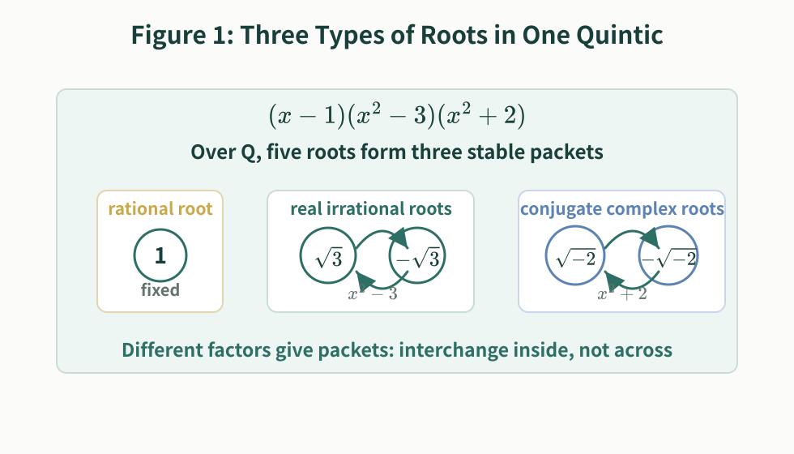
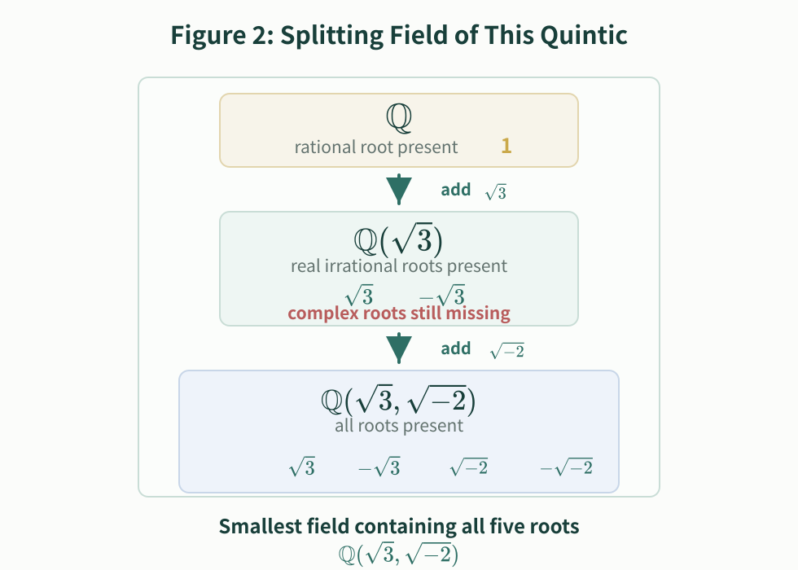
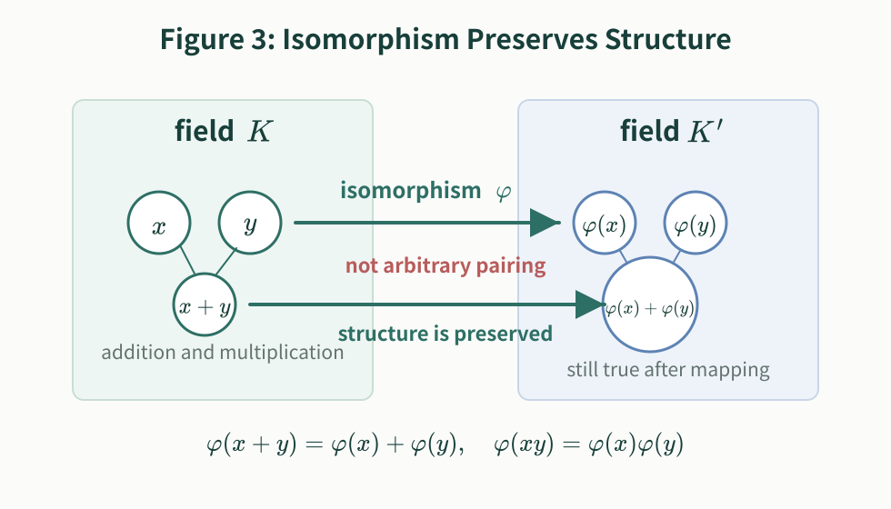
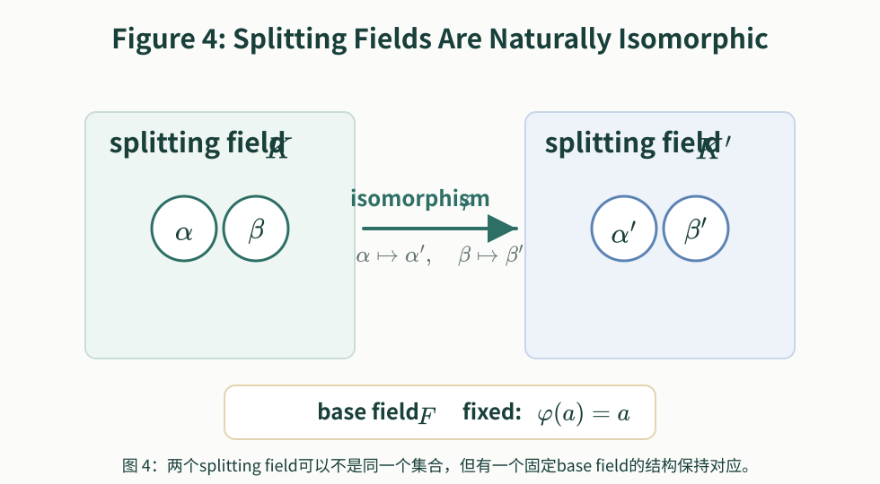
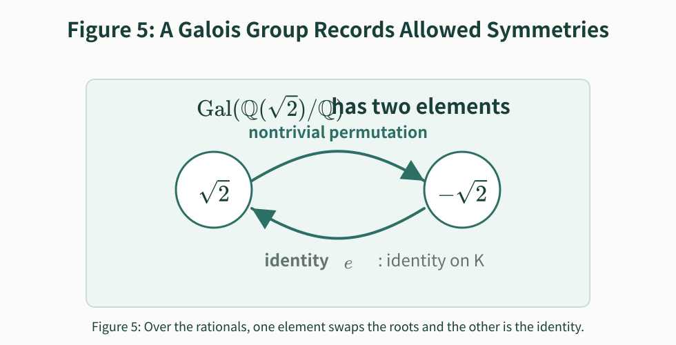
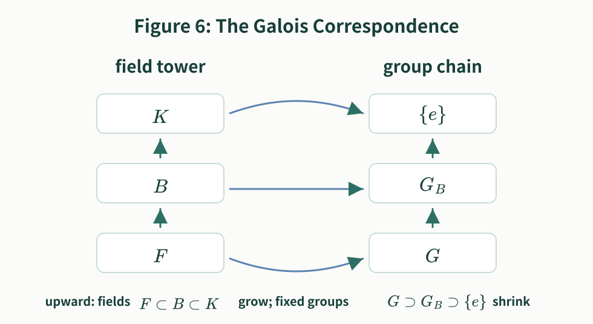
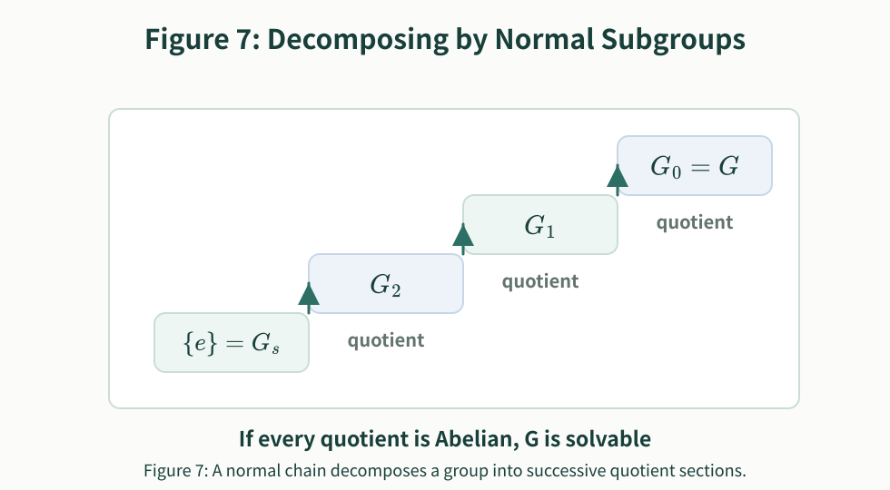
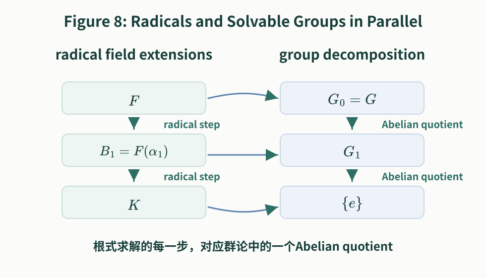
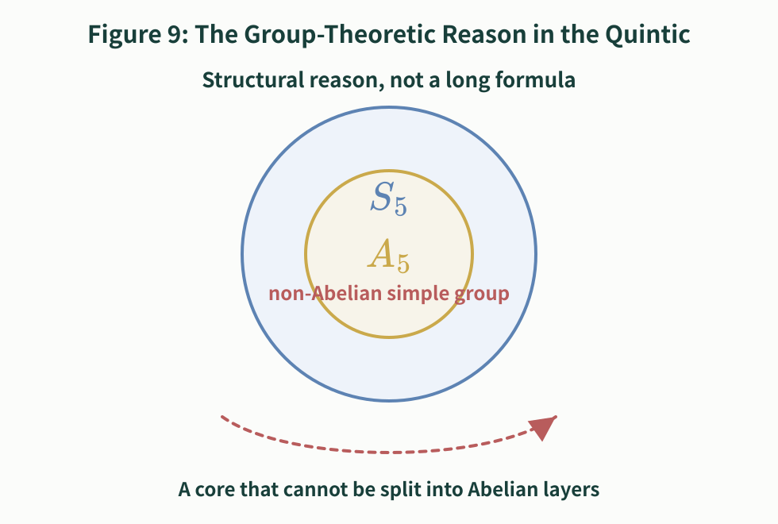

# Why the General Quintic Has No Formula by Radicals

Author: GitHub @mathwo  
Date: October 8, 2026  
Version: 1.0.1

A popular exposition of **Galois theory** through **radicals**, **symmetry**, **splitting fields**, and **solvable groups**.

This article follows one simple question: quadratic, cubic, and quartic equations all have formulas by radicals, so why is there no such formula for the general quintic? We start from concrete examples of roots and their symmetries, then introduce fields, splitting fields, Galois groups, normal subgroup chains, and solvable groups. The rigorous skeleton follows the route of Emil Artin's lectures on Galois theory, but the presentation is deliberately example-first.

## 1. Quadratic, Cubic, and Quartic Equations, and Vieta's Formulas

The quadratic formula is familiar. For

$$
ax^2+bx+c=0,
$$

one substitutes the coefficients and uses only arithmetic operations and a square root:

$$
x=\frac{-b\pm\sqrt{b^2-4ac}}{2a}.
$$

There are also formulas by radicals for cubic and quartic equations. The cubic formula is already much less pleasant. After reducing a cubic to the form \(x^3+px+q=0\), one expression for a root is

$$
x=\sqrt[3]{-\frac q2+\sqrt{\left(\frac q2\right)^2+\left(\frac p3\right)^3}}
  +\sqrt[3]{-\frac q2-\sqrt{\left(\frac q2\right)^2+\left(\frac p3\right)^3}}.
$$

If \(\Delta=\left(q/2\right)^2+\left(p/3\right)^3\), this becomes

$$
x=\sqrt[3]{-\frac q2+\sqrt{\Delta}}+\sqrt[3]{-\frac q2-\sqrt{\Delta}}.
$$

To get all three roots one also introduces a primitive cube root of unity, \(\omega=\dfrac{-1+i\sqrt3}{2}\). Then \(\omega^2=\dfrac{-1-i\sqrt3}{2}=\overline{\omega}\), \(\omega^3=1\), and \(\omega\ne1\). The other two roots are obtained by multiplying the cube-root pieces by \(\omega\) and \(\omega^2\) in the correct pattern.

Now the word **radical** should be made precise. Here a radical is not a root of an equation in general, but an expression built using root signs, such as \(\sqrt2\), \(\sqrt[3]{5}\), or \(\sqrt{b^2-4ac}\). A formula by radicals is a formula made from the coefficients by finitely many additions, subtractions, multiplications, divisions, and extractions of roots.

It was natural to ask whether the general quintic

$$
x^5+a_4x^4+a_3x^3+a_2x^2+a_1x+a_0=0
$$

also has such a universal formula.

The answer is no. But the reason is not that the formula is merely too long or that nobody has found it. The obstruction is structural.

Let the five roots be

$$
x_1,x_2,x_3,x_4,x_5.
$$

By **Vieta's formulas**, these roots satisfy relations determined by the coefficients:

$$
x_1+x_2+x_3+x_4+x_5=-a_4,
$$

$$
\sum_{i<j}x_ix_j=a_3,
$$

$$
\sum_{i<j<k}x_ix_jx_k=-a_2,
$$

$$
\sum_{i<j<k<\ell}x_ix_jx_kx_\ell=a_1,
$$

$$
x_1x_2x_3x_4x_5=-a_0.
$$

These relations are symmetric. If the roots are merely renamed, the sums and products above do not change. However, one must be careful: the fact that the Vieta relations are symmetric does not mean that the roots are always freely interchangeable.

For example, the equation \(x^2-5x+6=0\) has roots \(2\) and \(3\). Over the base field \(\mathbb Q\), both roots are already visible as rational numbers. So \(\mathbb Q\) can express not only \(r_1+r_2=5\) and \(r_1r_2=6\), but also the more specific relations \(r_1-2=0\) and \(r_2-3=0\). Swapping \(2\) and \(3\) would destroy those finer relations.

By contrast, the equation \(x^2-2=0\) has roots \(\sqrt2\) and \(-\sqrt2\). Neither root lies in \(\mathbb Q\). From the point of view of rational coefficients, the two roots satisfy the same algebraic relations and may still be interchanged.

<figure>
  
  <figcaption>Figure 1. Vieta's relations are symmetric, but whether roots may actually be interchanged depends on what the current base field and allowed operations can already distinguish.</figcaption>
</figure>

This is the first hint of the Galois-theoretic idea: solving an equation means adding enough information to distinguish roots that were previously indistinguishable.

## 2. Fields and Base Fields

A **field** is a number system in which addition, subtraction, multiplication, and division by nonzero elements all make sense. The rational numbers \(\mathbb Q\), the real numbers \(\mathbb R\), and the complex numbers \(\mathbb C\) are the standard examples.

The field from which the coefficients are taken is the **base field**. If an equation has rational coefficients, we usually begin with \(F=\mathbb Q\). A number not in \(F\) is not yet visible from the perspective of \(F\), even if it exists as a complex number.

Thus \(\sqrt2\notin\mathbb Q\). If the base field is \(\mathbb Q\), then \(\sqrt2\) has not yet been named by the field. Once we enlarge the field to \(\mathbb Q(\sqrt2)\), that number is now part of the allowed number system.

One can think of a larger field as a place where more information is visible. Over \(\mathbb Q\), the two roots of \(x^2-2\) look symmetric. Over \(\mathbb Q(\sqrt2)\), the root \(\sqrt2\) is already singled out, and the symmetry is broken.

## 3. Splitting Fields

A polynomial is easiest to study when all of its roots are available. The smallest field containing the base field and all roots of the polynomial is called its **splitting field**.

For example, \(x^2-2\) has roots \(\sqrt2\) and \(-\sqrt2\). After adjoining \(\sqrt2\) to \(\mathbb Q\), we get \(\mathbb Q(\sqrt2)\). This field already contains both roots, so it is the splitting field of \(x^2-2\) over \(\mathbb Q\). In that field,

$$
x^2-2=(x-\sqrt2)(x+\sqrt2).
$$

Now consider \(x^3-2\). Its three roots are

$$
\sqrt[3]{2},\qquad \omega\sqrt[3]{2},\qquad \omega^2\sqrt[3]{2},
$$

where \(\omega\) is a primitive cube root of unity. Adjoining only \(\sqrt[3]{2}\) gives the real root, but not the two complex roots. To make the polynomial split completely, we must also adjoin \(\omega\). Thus the splitting field is

$$
\mathbb Q(\sqrt[3]{2},\omega).
$$

<figure>
  
  <figcaption>Figure 2. A splitting field must contain every root, not just one chosen root.</figcaption>
</figure>

The phrase "splitting field" is literal: it is the field in which the polynomial splits into linear factors.

## 4. Isomorphisms of Splitting Fields

The next idea is **isomorphism**. An isomorphism between fields is not an arbitrary pairing of elements. It is a bijection that preserves addition and multiplication:

$$
\varphi(x+y)=\varphi(x)+\varphi(y),\qquad
\varphi(xy)=\varphi(x)\varphi(y).
$$

Because subtraction and division can be expressed in terms of addition and multiplication, these operations are preserved as well.

<figure>
  
  <figcaption>Figure 3. An isomorphism is not a random matching of elements; it transports the additive and multiplicative structure of one field into another.</figcaption>
</figure>

Suppose two splitting fields \(K\) and \(K'\) arise from the same polynomial over the same base field \(F\). If \(\alpha\) is a root in \(K\), and \(\alpha'\) is the corresponding root in \(K'\), then an isomorphism may send

$$
\alpha\mapsto\alpha',\qquad \beta\mapsto\beta',
$$

but it must preserve all algebraic relations with coefficients in \(F\). In particular, every element \(a\in F\) must be fixed:

$$
\varphi(a)=a.
$$

Such maps are called **\(F\)-isomorphisms**: they preserve the field structure and leave the base field fixed.

<figure>
  
  <figcaption>Figure 4. Two splitting fields may not be literally the same set, but they can be structurally the same over the fixed base field.</figcaption>
</figure>

This viewpoint lets us talk about the symmetries of the roots without depending on how the roots have been represented.

## 5. The Galois Group

Let \(K\) be the splitting field of a polynomial over a base field \(F\). The **Galois group** of \(K/F\), denoted

$$
\operatorname{Gal}(K/F),
$$

is the group of all field automorphisms of \(K\) that fix every element of \(F\).

An automorphism is an isomorphism from \(K\) to itself. It may move roots around, but it is not allowed to move the coefficients in the base field.

For the polynomial \(x^2-2\), the splitting field over \(\mathbb Q\) is \(K=\mathbb Q(\sqrt2)\). There are two automorphisms of \(K\) fixing \(\mathbb Q\):

- the identity automorphism, which sends \(\sqrt2\) to \(\sqrt2\);
- the nontrivial automorphism, which sends \(\sqrt2\) to \(-\sqrt2\).

Thus

$$
\operatorname{Gal}(\mathbb Q(\sqrt2)/\mathbb Q)
$$

has two elements.

<figure>
  
  <figcaption>Figure 5. Over the rational numbers, this Galois group has two elements: one interchanges the two roots, and the other is the identity map on the splitting field.</figcaption>
</figure>

Notice the key point: a Galois group does not record every imaginable permutation of roots. It records only those permutations that come from structure-preserving automorphisms of the splitting field.

## 6. Subgroups and Intermediate Fields

The **Fundamental Theorem of Galois Theory** says, roughly, that intermediate fields correspond to subgroups of the Galois group.

Suppose

$$
F\subset B\subset K.
$$

The intermediate field \(B\) sits between the base field \(F\) and the splitting field \(K\). To this field one associates a subgroup

$$
G_B=\{\sigma\in\operatorname{Gal}(K/F):\sigma(b)=b\text{ for every }b\in B\}.
$$

In words: \(G_B\) consists of the automorphisms that fix every element of \(B\).

This gives a reversal of direction:

$$
F\subset B\subset K
$$

corresponds to

$$
\operatorname{Gal}(K/F)\supset G_B\supset\{e\}.
$$

The larger the intermediate field, the more elements it asks automorphisms to fix, so the smaller the corresponding subgroup becomes.

<figure>
  
  <figcaption>Figure 6. Moving upward in the chain makes the field larger; the corresponding fixed group becomes smaller.</figcaption>
</figure>

There is an especially important condition here. If an intermediate field \(B\) is itself a splitting field over \(F\), then the corresponding subgroup is a **normal subgroup**. Conversely, normal subgroups correspond to intermediate fields that behave well over the base field.

If \(N\triangleleft G\), one can form the **quotient group**

$$
G/N.
$$

The elements of \(G/N\) are cosets, not single group elements:

$$
gN=\{gn:n\in N\}.
$$

The multiplication rule is

$$
(gN)(hN)=(gh)N.
$$

This is well defined precisely because \(N\) is normal.

Normal subgroups and quotient groups are the mechanism by which a complicated group can be decomposed into simpler pieces.

## 7. Solvable Groups and Solution by Radicals

A group \(G\) is called **solvable** if it can be reduced to the trivial group through a chain of normal subgroups in which every quotient is Abelian. One common form is

$$
\{e\}=G_s\triangleleft G_{s-1}\triangleleft\cdots\triangleleft G_1\triangleleft G_0=G,
$$

and each quotient

$$
G_{i-1}/G_i
$$

must be an Abelian group.

<figure>
  
  <figcaption>Figure 7. A normal subgroup chain decomposes a group into successive sections; each section is described by a quotient of neighboring groups.</figcaption>
</figure>

An **Abelian group** is a group whose operation is commutative:

$$
ab=ba.
$$

The integers under addition form an Abelian group, because

$$
a+b=b+a.
$$

The symmetric group \(S_3\), the group of all permutations of three objects, is not Abelian. The order in which two permutations are composed can matter.

Why does this matter for equations? Because extracting radicals produces field extensions in small, controlled steps, and Galois theory translates those controlled field extensions into Abelian quotient groups.

The central theorem can be stated as follows:

> A polynomial is solvable by radicals if and only if its Galois group is a solvable group.

Here is the intuitive content of the two directions.

**First: solvable by radicals \(\Rightarrow\) solvable Galois group**

If the roots can be obtained by radicals, then the splitting field sits inside a chain obtained by repeatedly adjoining radicals. Each radical step has a relatively simple Galois-theoretic effect: it contributes an Abelian quotient. Translating the whole chain through the Galois correspondence gives a normal subgroup chain with Abelian quotients. Therefore the Galois group is solvable.

**Second: solvable Galois group \(\Rightarrow\) solvable by radicals**

If the Galois group has such a normal subgroup chain, the Fundamental Theorem of Galois Theory converts it back into a chain of intermediate fields. When the quotients are Abelian, the corresponding field extensions can be constructed using radicals, after adjoining the necessary roots of unity. Thus the roots can be expressed by radicals.

<figure>
  
  <figcaption>Figure 8. A radical solution gives a tower of field extensions; Galois theory translates that tower into normal subgroups and Abelian quotient groups.</figcaption>
</figure>

This is the bridge between algebraic formulas and group structure.

## 8. Why \(S_5\) Is Not Solvable

Let \(S_n\) be the **symmetric group** on \(n\) letters: the group of all permutations of \(n\) objects. For a general polynomial of degree \(n\), the roots are typically as independent as possible, and the Galois group is the full \(S_n\).

For \(n=2,3,4\), the groups that appear in the general equation are solvable. This is why the quadratic, cubic, and quartic equations have formulas by radicals.

The situation changes at \(n=5\). The group \(S_5\) is not solvable. The reason is that \(S_5\) contains the alternating group \(A_5\), the subgroup of even permutations of five objects.

The group \(A_5\) has two crucial properties:

1. \(A_5\) is not Abelian.
2. \(A_5\) is simple: it has no nontrivial normal subgroups.

Here "nontrivial" means different from \(\{e\}\) and from the whole group. Because \(A_5\) is non-Abelian and has no nontrivial normal subgroup through which it can be decomposed, it cannot be broken into Abelian quotient pieces.

Thus \(A_5\) is the first major non-Abelian simple group. Since this obstruction sits inside \(S_5\), the group \(S_5\) itself is not solvable.

<figure>
  
  <figcaption>Figure 9. The general quintic cannot have a universal radical formula because \(S_5\) contains \(A_5\), which cannot be decomposed into Abelian quotient groups.</figcaption>
</figure>

## 9. Quintic Examples

Now let us look at several quintic equations.

**Equation 1: \(x^5-2=0\).**

Let \(\alpha=\sqrt[5]{2}\) and let \(\zeta=\zeta_5\) be a primitive fifth root of unity. The five roots are

$$
\alpha,\quad \zeta\alpha,\quad \zeta^2\alpha,\quad \zeta^3\alpha,\quad \zeta^4\alpha.
$$

The splitting field is

$$
K=\mathbb Q(\alpha,\zeta).
$$

This example is special: its Galois group is not the whole \(S_5\). If we write the roots as

$$
r_j=\zeta^j\alpha,\qquad j=0,1,2,3,4,
$$

then an automorphism may send \(\alpha\) to \(\zeta^b\alpha\), and may send \(\zeta\) to \(\zeta^a\), where \(a\in(\mathbb Z/5\mathbb Z)^\times\) and \(b\in\mathbb Z/5\mathbb Z\). On indices this gives

$$
j\longmapsto aj+b.
$$

There are five choices for \(b\) and four choices for \(a\), so the Galois group has \(5\cdot4=20\) elements:

$$
\operatorname{Gal}(K/\mathbb Q)\cong C_5\rtimes C_4.
$$

The symbol \(\rtimes\) denotes a **semidirect product**. The important point is that this group can be decomposed through a chain

$$
\{e\}\triangleleft C_5\triangleleft C_5\rtimes C_4,
$$

whose quotient groups are \(C_5\) and \(C_4\). Both are Abelian. Therefore the Galois group is solvable, and the equation can be solved by radicals. Indeed, \(\alpha=\sqrt[5]{2}\) is already one root, and adjoining the fifth roots of unity gives all the roots.

**Equation 2: \(x^5-x-1=0\).**

This equation behaves very differently. Let \(L\) be its splitting field. Its Galois group over \(\mathbb Q\) is

$$
\operatorname{Gal}(L/\mathbb Q)\cong S_5.
$$

Here is a compact computational justification. For a polynomial \(f(x)=x^5+ax+b\), the discriminant is

$$
\Delta(f)=\operatorname{Res}(f,f')=5^5b^4+4^4a^5.
$$

For \(f(x)=x^5-x-1\), we have \(a=-1\) and \(b=-1\), so

$$
\Delta(f)=5^5(-1)^4+4^4(-1)^5=3125-256=2869.
$$

The discriminant \(2869\) is not a rational square. The square root of the discriminant is, up to sign, the product

$$
\prod_{i<j}(r_i-r_j).
$$

Even permutations of the roots preserve this product, while odd permutations change its sign. Thus a nonsquare discriminant shows that the Galois group is not contained in \(A_5\); it contains an odd permutation.

Now reduce modulo primes. Modulo \(3\), the polynomial \(x^5-x-1\) remains irreducible. By Dedekind's theorem this shows that the Galois group contains a 5-cycle. Modulo \(2\),

$$
x^5-x-1\equiv x^5+x+1\pmod2,
$$

This factorization is meant in the polynomial ring \(\mathbb F_2[x]\), not as an ordinary identity over the integers. Here \(\mathbb F_2\) is the field with two elements, \(0\) and \(1\), with addition and multiplication taken modulo \(2\). The notation \(\mathbb F_2[x]\) means the ring of polynomials in \(x\) whose coefficients lie in \(\mathbb F_2\), with polynomial addition and multiplication also computed modulo \(2\).

Over the integers, expanding the right hand side gives

$$
(x^2+x+1)(x^3+x^2+1)=x^5+2x^4+2x^3+2x^2+x+1.
$$

But modulo \(2\), every coefficient \(2\) becomes \(0\). Thus

$$
x^5+x+1\equiv(x^2+x+1)(x^3+x^2+1)\pmod2.
$$

This gives an element of cycle type \((2)(3)\). Combining these facts with the classification of transitive subgroups of \(S_5\), one obtains the full group \(S_5\). Since \(S_5\) is not solvable, the equation \(x^5-x-1=0\) is not solvable by radicals.

**Equation 3: \(x^5+x^4+x^3+x^2+x+2=0\).**

This example has positive integer coefficients, but it is still not solvable by radicals. Let \(M\) be its splitting field. The same modular method shows

$$
\operatorname{Gal}(M/\mathbb Q)\cong S_5.
$$

Modulo \(13\), the polynomial remains irreducible of degree \(5\), giving a 5-cycle. Modulo \(3\), it factors as

$$
x^5+x^4+x^3+x^2+x+2
\equiv (x^2+2x+2)(x^3+2x^2+x+1)\pmod3.
$$

Thus the Galois group contains an element of cycle type \((2)(3)\). As in Equation 2, this forces the full \(S_5\), and so the equation is not solvable by radicals.

Now consider a less trivial special quintic that is solvable by radicals.

**Equation 4: \(x^5+5x^3+5x-1=0\).**

This is not the direct form \(x^5-a=0\). It is solvable because it hides a useful substitution. Let

$$
x=u-v,\qquad uv=1.
$$

Using the identity

$$
(u-v)^5+5uv(u-v)^3+5u^2v^2(u-v)=u^5-v^5,
$$

and using \(uv=1\), we get

$$
x^5+5x^3+5x=u^5-v^5.
$$

The original equation is therefore equivalent to

$$
u^5-v^5=1.
$$

Since \(uv=1\), we also have \(u^5v^5=1\). Let \(T=u^5\). Then \(v^5=1/T\), and

$$
T-\frac1T=1,
$$

so

$$
T^2-T-1=0.
$$

The quadratic equation gives

$$
T=\frac{1+\sqrt5}{2}\quad\text{or}\quad T=\frac{1-\sqrt5}{2}.
$$

Choose

$$
A=\sqrt[5]{\frac{1+\sqrt5}{2}},
$$

and let \(\zeta=\zeta_5\). Then the five roots can be written as

$$
x_k=\zeta^kA-\zeta^{-k}A^{-1},\qquad k=0,1,2,3,4.
$$

Indeed, take \(u=\zeta^kA\) and \(v=\zeta^{-k}A^{-1}\). Then \(uv=1\), and

$$
u^5-v^5=\frac{1+\sqrt5}{2}-\frac{2}{1+\sqrt5}=1.
$$

Thus every \(x_k=u-v\) satisfies the original equation. The solution uses only arithmetic operations, a square root, fifth roots, and fifth roots of unity. This is a genuinely nontrivial quintic that is nevertheless solvable by radicals.

Together, these examples show the correct distinction: special quintics may be solvable by radicals, but the general quintic has Galois group \(S_5\), and \(S_5\) is not solvable.

Finally, one may ask a probabilistic question: if all coefficients of a quintic are natural numbers, how likely is it that the equation is not solvable by radicals?

One must first specify a model of randomness. A common model is: fix a large bound \(B\), choose \(a_0,a_1,a_2,a_3,a_4\) independently and uniformly from \(1,2,\ldots,B\), and consider the quintic with leading coefficient \(1\):

$$
x^5+a_4x^4+a_3x^3+a_2x^2+a_1x+a_0=0.
$$

If the leading coefficient is also chosen randomly, the intuition is the same; taking it to be \(1\) simply avoids counting scalar multiples of the same equation repeatedly.

In this model, as \(B\to\infty\), the probability that the equation is not solvable by radicals tends to \(1\), that is, to \(100\%\). The underlying reason is van der Waerden's theorem on random polynomials and modern strengthenings: a random integer polynomial of degree \(5\) almost always has Galois group \(S_5\). Since \(S_5\) is not solvable, it is almost always not solvable by radicals.

For concrete finite values, the probability is already high. In the model above, a full enumeration at \(B=10\) gives about \(92.8\%\); large-sample estimation at \(B=100\) gives about \(99.4\%\). These numbers are not the theorem itself, but they help show how quickly the probability moves toward \(1\).

Informally: if the coefficient bound \(B\) is large enough, a randomly written quintic with natural-number coefficients has probability very close to \(100\%\) of not being solvable by radicals. Formally, the statement is a limit:

$$
\lim_{B\to\infty}\Pr(\text{random quintic is not solvable by radicals})=1.
$$

## 10. Higher-Degree Equations

After the general quintic fails to have a formula by radicals, the natural next question is: what about degree \(6\), degree \(7\), and beyond?

The conclusion is:

**The general equation of degree \(n\) has no universal formula by radicals for every \(n\ge5\).**

This is the content of the **Abel-Ruffini theorem**: for every \(n\ge5\), there is no general formula that expresses the roots of an arbitrary degree-\(n\) polynomial using only its coefficients, finitely many arithmetic operations, and radicals. The theorem rules out a universal radical formula; it does not say that every special equation of degree \(n\ge5\) is unsolvable by radicals.

The reason is the same as in the quintic case. The Galois group of the general degree-\(n\) equation is \(S_n\). For \(n\ge5\), the group \(S_n\) is not solvable.

One concrete way to see the obstruction is that \(S_n\) contains a copy of \(S_5\): permute five chosen roots and leave all the remaining roots fixed. Thus \(S_n\) contains the same non-Abelian simple obstruction \(A_5\) that appears in the quintic.

It remains important to distinguish several statements:

- Some special higher-degree equations are solvable by radicals because their Galois groups are smaller solvable groups.
- Even if an equation is not solvable by radicals, its roots still exist in \(\mathbb C\).
- In numerical work, one can approximate roots by methods such as Newton's method.
- If one allows functions beyond radicals, some quintic and higher-degree equations can be expressed in other ways.

There is also a natural question: is the problem merely that we are working inside the complex numbers? Would enlarging the number system further remove the obstruction?

The answer is no in the relevant sense. As a place where algebraic roots live, the complex field \(\mathbb C\) is already large enough. By the **Fundamental Theorem of Algebra**, every nonconstant polynomial with complex coefficients splits into linear factors over \(\mathbb C\). The roots are not hidden in some ordinary larger field beyond \(\mathbb C\).

Of course, if one artificially adjoins a root \(r\) itself to the base field, forming \(F(r)\), then \(r\) is already present. But that is not solving the equation by radicals; it is putting the answer into the allowed numbers by hand. Radical solution means starting from the coefficient field and obtaining roots through arithmetic operations and root extractions.

Thus Abel-Ruffini denies the existence of a universal formula using arithmetic operations and radicals for all equations of degree \(n\ge5\). It does not deny every possible representation of roots by broader special functions.

## 11. Conclusion

The general quintic has no formula by radicals not because the formula is too long, and not because it has not yet been found. The reason is structural: the roots of the general quintic have the full \(S_5\) symmetry, while radicals can only resolve symmetries that break through Abelian quotient groups.

Galois theory gives a criterion rather than a more clever formula. Put the roots into the splitting field, look at the automorphisms that fix the coefficients, and study the resulting Galois group. If that group is solvable, the equation is solvable by radicals. If that group is not solvable, a radical formula does not exist.

This also explains why some special quintics can still be solved by radicals. Their Galois groups may be smaller than \(S_5\) and may be solvable. What fails is not every individual quintic, but a single radical formula that works for the general quintic.

---

References:

1. Emil Artin, *Galois Theory*. The rigorous structure of this article follows the lectures' route through extension fields, splitting fields, the Fundamental Theorem of Galois Theory, solvable groups, solution by radicals, and the general equation of degree \(n\); the exposition here is rewritten for a popular audience.
2. Manjul Bhargava, "Galois groups of random integer polynomials and van der Waerden's Conjecture," *Annals of Mathematics*, 201(2), 339-377, 2025. [Annals page](https://annals.math.princeton.edu/2025/201-2/p01); [arXiv:2111.06507](https://arxiv.org/abs/2111.06507). The probabilistic statement in Section 9 about random integer polynomials almost always having Galois group \(S_n\), and therefore random natural-number quintics almost always not being solvable by radicals, is based on this result.
