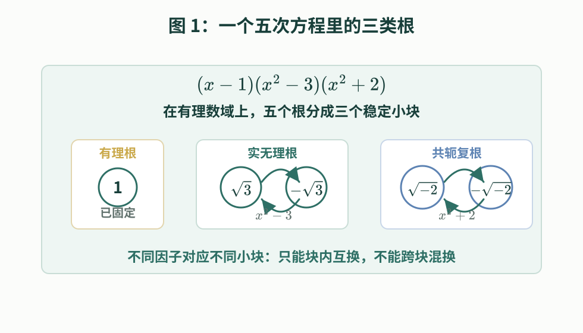
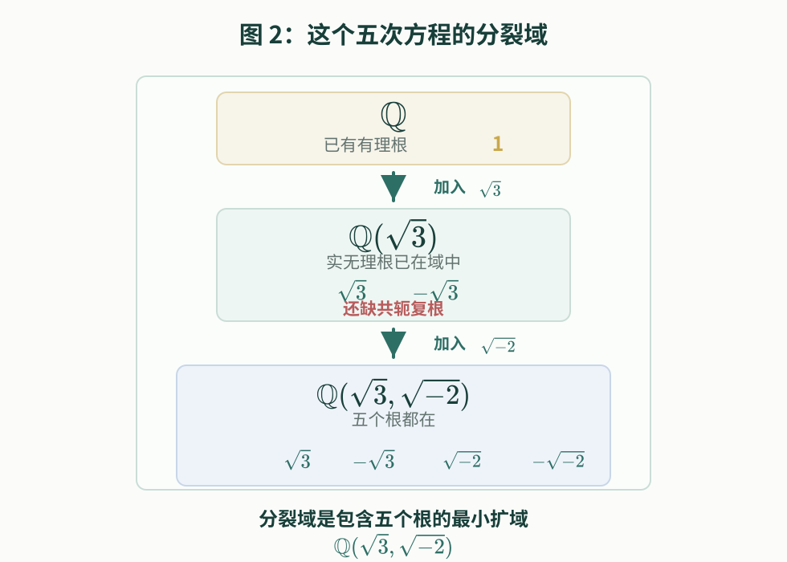
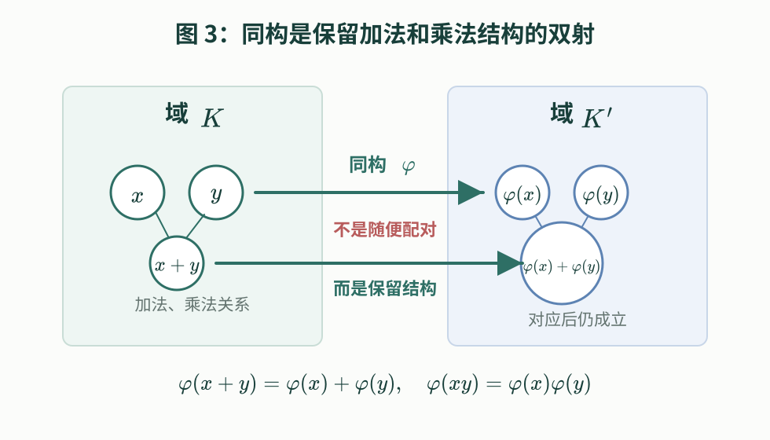
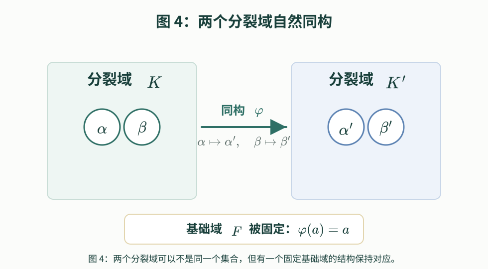
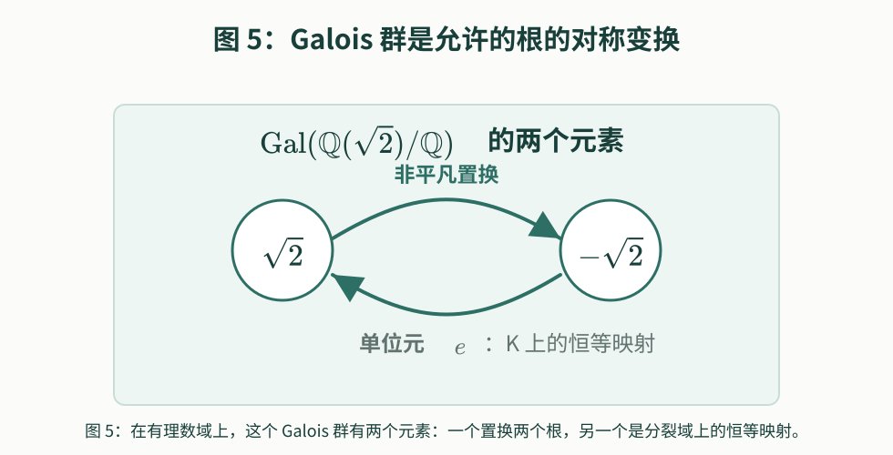
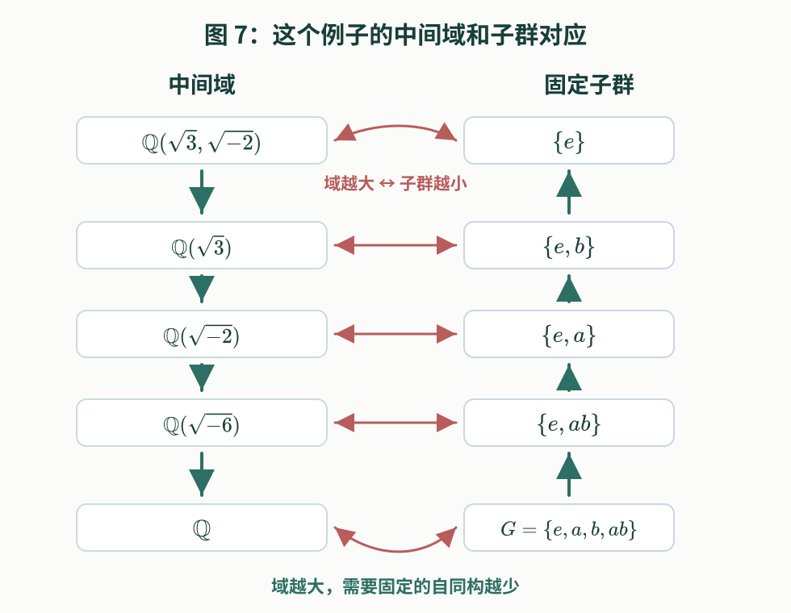
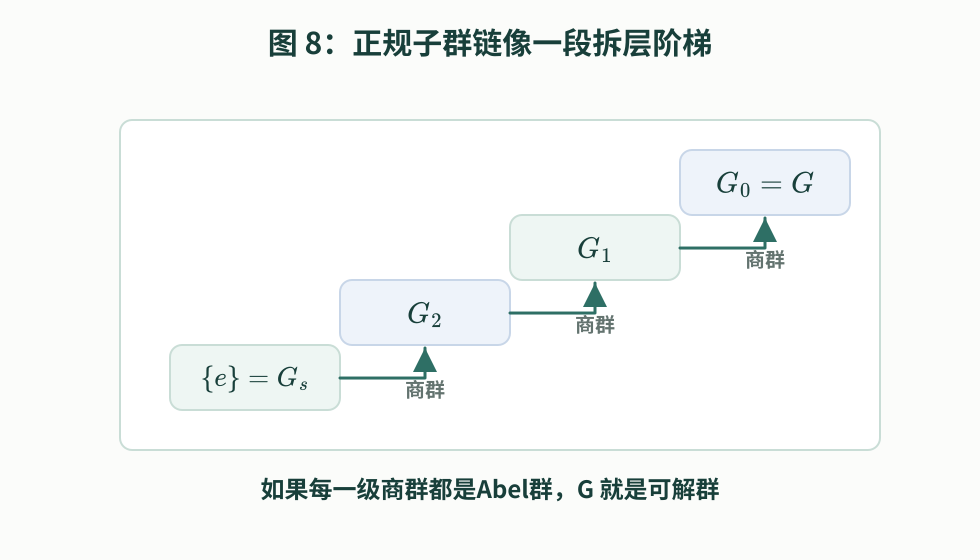
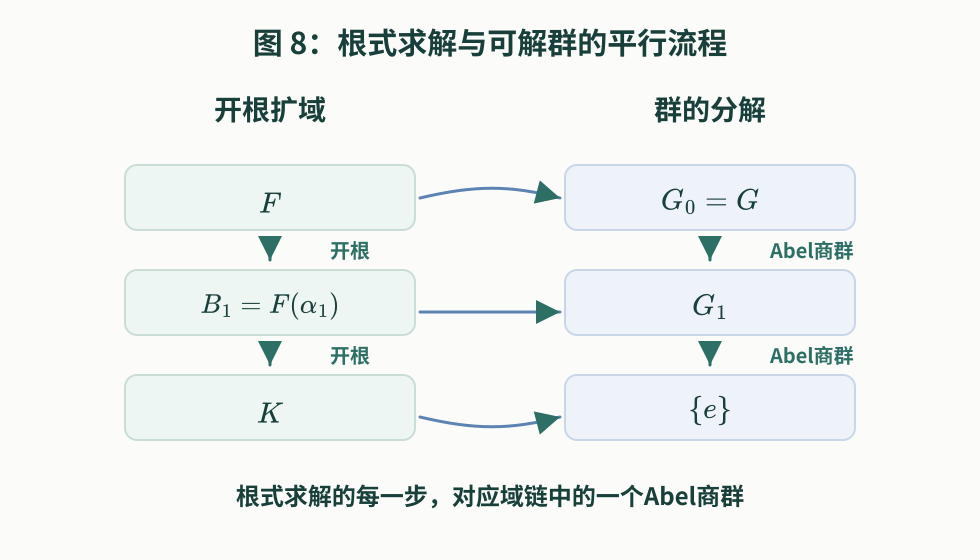
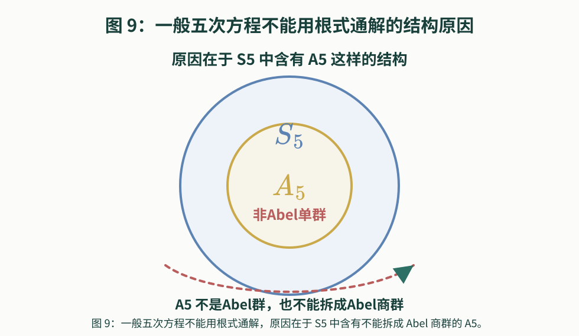

# 为什么一般五次方程没有通用根式求解公式

作者：GitHub @mathwo  
日期：2026 年 10 月 8 日  
版本：1.0.2

一篇从**根式**（Radicals）、**对称性**（Symmetry）、**分裂域**（Splitting Field）到**可解群**（Solvable Group）的 **Galois 理论**（Galois Theory）科普

这篇文章沿着一个朴素问题展开：二次、三次、四次方程都有**根式公式**（Formula by Radicals），为什么一般五次方程没有？我们会先从**群**（Group）、**数域**（Field）、**根的置换映射**（Permutation of Roots）说起，再把**根式扩张**（Radical Extension）和分裂域放在一起讲，最后引出 **Galois 群**（Galois Group）、**正规子群链**（Normal Subgroup Chain）和可解群。文章的严谨骨架借鉴了 Emil Artin 关于 Galois 理论的讲义，但叙述会尽量从具体例子出发。

## 1. 二三四次方程和韦达定理

二次方程的公式大家很熟悉。对于

$$
ax^2+bx+c=0
$$

只要代入系数，再做四则运算和开平方，就能得到两个根：

$$
x=\frac{-b\pm\sqrt{b^2-4ac}}{2a}.
$$

后来，人们也找到了三次方程和四次方程的根式公式。公式虽然复杂得多，但原则上仍然只用加、减、乘、除和开方。

三次方程的解法通常先把一般三次方程通过换元，化成没有 $y^2$ 项的形式。这个形式常叫**降次三次方程**（Depressed Cubic）：

$$
y^3+py+q=0.
$$

**Cardano 公式**（Cardano's Formula）可以这样写。令

$$
\Delta=\left(\frac q2\right)^2+\left(\frac p3\right)^3,
$$

再取两个立方根

$$
\begin{aligned}
A&=\sqrt[3]{-\frac q2+\sqrt{\left(\frac q2\right)^2+\left(\frac p3\right)^3}}\\
 &=\sqrt[3]{-\frac q2+\sqrt{\Delta}},
\end{aligned}
$$

$$
\begin{aligned}
B&=\sqrt[3]{-\frac q2-\sqrt{\left(\frac q2\right)^2+\left(\frac p3\right)^3}}\\
 &=\sqrt[3]{-\frac q2-\sqrt{\Delta}}.
\end{aligned}
$$

再引入三次**单位根**（Root of Unity） $\omega=\dfrac{-1+i\sqrt3}{2}$ ，于是 $\omega^2=\dfrac{-1-i\sqrt3}{2}=\overline{\omega}$ ，并且 $\omega^3=1$ ， $\omega\neq 1$ 。

这里有一个小技术点：立方根有三个可能值，所以 $A$ 和 $B$ 的选择要配套。换句话说，要选到满足 $AB=-\dfrac p3$ 的那一组 $A,B$ 。在这样的选择下，三个根可以写成 $y_1=A+B$ ， $y_2=\omega A+\omega^2B$ ， $y_3=\omega^2A+\omega B$ 。

这个公式看起来已经比二次公式复杂许多：它不只用到平方根，还用到立方根，而且自然会出现复数和单位根。这里不要求读者记住公式本身；我们只需要注意，它仍然只用了四则运算和开方，所以仍然属于**根式求解**（Solution by Radicals）。

现在可以回头说清楚“根式”这个词。这里的**根式**（Radicals）不是指“方程的根”本身，而是指用开方符号构造出来的表达式，例如 $\sqrt{2}$ 、 $\sqrt[3]{5}$ 、 $\sqrt{b^2-4ac}$ 。

所谓“用根式表示一个根”，意思是：从方程的系数出发，只允许做有限次加、减、乘、除，以及开平方、开立方、开四次方，或者更一般的开 $n$ 次方，最后写出方程根的表达式。这样的求解方式就叫根式求解。

四次方程的解法则更进一步。**Ferrari 方法**（Ferrari's Method）会通过配方和引入辅助量，把四次方程转化为一个相关的三次方程。求出这个辅助三次方程的根以后，再把原四次方程拆成两个二次方程，于是最终仍然能用平方根、立方根等根式表达四个根。

所以，从二次到三次、四次，故事表面上像是：公式越来越复杂，但仍然能写出来。真正令人意外的是：到了五次，并不是公式“更长一点”就能解决，而是一般情形下根式公式根本不存在。

于是自然会问：一般五次方程是否也有一个万能公式？也就是说，对于

$$
ax^5+bx^4+cx^3+dx^2+ex+f=0,
$$

其中 $a\neq 0$ ，能不能只靠系数和根式，写出所有根？

读者很可能先想到一个更温和的求解方案：不一定非要一次写出五个根。能不能先找到其中一个根的精确**根式表达式**（Expression by Radicals），记作 $r$ ？如果已经得到这个根 $r$ ，那么原**多项式**（Polynomial）就可以除以 $x-r$ ，得到一个四次多项式。四次方程已经有 Ferrari 公式，于是剩下四个根也能求出来。这样看来，求解五次方程似乎只需要攻下第一步：**先用根式找到一个根**。

“先求一个根，再降成四次方程”这个求解方案非常自然，而且方向也对。困难在于：对于一般五次方程，连这样一个“通用的第一个根的根式表达式”也不存在。因为一旦存在这样的根式表达式，我们就能通过降次把一般五次方程全部解决掉。

为了看清“一般五次方程为什么连第一个根也选不出来”，先不要急着求根，而是把五个根和系数之间的关系完整写出来。设这个五次方程的五个根是 $x_1,x_2,x_3,x_4,x_5$ 。

根据**韦达定理**（Vieta's Formulas），这五个根满足一组由系数决定的关系。为了把这些关系写得紧凑一点，先约定两个记号：

$$
\sum_{\mathrm{cyc}} x_i=x_1+x_2+x_3+x_4+x_5,
$$

$$
\prod_{\mathrm{cyc}} x_i=x_1x_2x_3x_4x_5.
$$

这里的 $\mathrm{cyc}$ 来自**循环记号**（Cyclic Notation），意思是按循环顺序

$$
(1,2,3,4,5)\mapsto(2,3,4,5,1)\mapsto\cdots
$$

把同类项依次写出来。对于五个根来说，单根之和和五根之积可以这样写；两两乘积、三三乘积、四四乘积需要把所有不同选法都列入，所以仍然用组合下标来写。

于是韦达定理给出：

$$
\sum_{\mathrm{cyc}} x_i=-\frac ba,
$$

$$
\sum_{1\le i\lt j\le 5}x_ix_j=\frac ca,
$$

$$
\sum_{1\le i\lt j\lt k\le 5}x_ix_jx_k=-\frac da,
$$

$$
\sum_{1\le i\lt j\lt k\lt l\le 5}x_ix_jx_kx_l=\frac ea,
$$

以及

$$
\prod_{\mathrm{cyc}}x_i=-\frac fa.
$$

上面这些表达式对于根的**循环轮换**（Cycle）是不变的。也就是说，如果把五个根按

$$
x_1\mapsto x_2,\qquad x_2\mapsto x_3,\qquad x_3\mapsto x_4,\qquad x_4\mapsto x_5,\qquad x_5\mapsto x_1,
$$

循环置换，上述表达式的值都不会变。

事实上，这些韦达关系比“循环轮换不变”还要更强：如果任意置换五个根，它们的值也不会变。比如 $x_1+x_2+x_3+x_4+x_5$ 只是把五个根加在一起，当然不在乎哪个根叫 $x_1$ ，哪个根叫 $x_2$ 。两两乘积之和、三三乘积之和、四四乘积之和、五根乘积也是这样。

这就是“根之间有对称性”的具体含义：由系数决定的许多关系，并不依赖某个根被叫作 $x_1$ 还是 $x_2$ ，而只依赖所有根作为一个整体如何组合在一起。

但是这里要非常小心：**韦达定理给出的关系是对称的，不代表所有根都一定可以任意置换。**

如果我们只看韦达关系，那么任意置换根确实都不会改变韦达关系。例如，三次情形中的 $r_1+r_2+r_3$ ，或者这里的 $x_1+x_2+x_3+x_4+x_5$ ，都不在乎哪个根叫 $r_1$ 或 $x_1$ ，哪个根叫 $r_2$ 或 $x_2$ 。这只能说明：**仅凭韦达关系，我们还没有把这些根分别表达出来。**

## 2. 群，数域，根的置换映射，根的互换性

我们要把“区分一个根”说成更具体的数学问题：在指定的数域 $F$ 内，使用指定的运算，能不能表达出原方程的某个根？如果某个根已经能用 $F$ 中的数和允许的运算表达出来，那么这个根就已经被当前的数域和运算规则确定下来，不能与其它根相互置换。如果几个根在当前规则下还不能分别表达出来，那么这些根相互置换，可能不会改变当前数域能够写出的代数关系。

这里的“根相互置换”需要再说具体一点。设一个方程有三个根 $r_1,r_2,r_3$ 。我们可以规定一种重新对应方式： $r_1\mapsto r_2$ ， $r_2\mapsto r_3$ ， $r_3\mapsto r_1$ 。

这表示：原来由 $r_1$ 占据的位置，现在换成 $r_2$ ；原来由 $r_2$ 占据的位置，现在换成 $r_3$ ；原来由 $r_3$ 占据的位置，现在换成 $r_1$ 。这种“每个根被映射到哪个根”的重新对应方式，严格说叫作根的一个**置换映射**。

如果根的集合是 $\{r_1,r_2,\dots,r_n\}$ ，那么根集合上的一个置换映射，就是从这个集合到它自身的一个**双射**（Bijection）：

$$
\{r_1,r_2,\dots,r_n\}\longrightarrow \{r_1,r_2,\dots,r_n\}.
$$

这里“双射”的意思是：每个根都被映射到某个根；不同的根不会被映射到同一个根；也不会漏掉任何一个根。换句话说，置换映射不是把根写成一排给人看，而是规定每个根被映射到哪个根。比如三个根一共有 $3!=6$ 个置换映射；每一个置换映射都可以看成一种“重新命名根”的变换。

这时就可以引入**群**的概念了。抽象地说，群是一组元素，加上一种**群运算**（Group Operation）。如果两个元素是 $a$ 和 $b$ ，它们的群运算结果通常记作 $ab$ 。在根的置换映射这个例子里，群里的元素就是置换映射，群运算就是“先做一个置换映射，再做另一个置换映射”的复合。

根集合上的置换映射正好有这个特点：先做一个置换映射，再做另一个置换映射，结果仍然是一个置换映射；每个置换映射都能撤销；还有一个恒等置换映射，也就是每个根都映射成它自身。这样的变换系统，就是群的典型例子。

更一般地说，一个群 $G$ 需要满足几件事：

- 封闭性：两个群元素做群运算以后，结果仍然是这个群里的元素。
- 可逆性：每个群元素都有逆元。
- 有单位元：存在一个特殊元素，通常记作 $e$ ，使得对任意群元素 $a$ ，都有 $ea=ae=a$ 。
- 满足结合律：连续做三件事时，加括号的方式不影响结果。

在置换群这个具体例子里，单位元 $e$ 才表现为恒等置换映射：每个根都映射成它自身。

如果一个方程有 $n$ 个根，那么所有“把这 $n$ 个根重新对应到这 $n$ 个根”的置换映射，组成**对称群**（Symmetric Group） $S_n$ 。这里 $S_n$ 的意思就是： $n$ 个元素的所有置换映射组成的群。

所以我们真正要研究的是：

> 在固定**基础域**（Base Field） $F$ 和允许的**代数关系**（Algebraic Relations）下，根集合上的哪些置换映射，也就是哪些“把根重新对应到根”的变换，会保持所有 $F$ -系数代数关系不变？

这里的“基础域 $F$ ”指的是我们一开始允许使用的数。比如研究**有理系数方程**（Polynomial Equation with Rational Coefficients）时，通常取 $F=\mathbb{Q}$ 。

“ $F$ -系数代数关系”指的是：用 $F$ 里的数作为系数，写出的关于根的多项式等式。韦达关系属于这类关系，但它们只是其中一部分。

看一个最简单的例子：

$$
(x-2)(x-3)=x^2-5x+6.
$$

方程 $x^2-5x+6=0$ 的两个根是 $r_1=2$ ， $r_2=3$ 。

如果基础域是 $\mathbb{Q}$ ，那么 $2$ 和 $3$ 本来就在 $\mathbb{Q}$ 里。因此除了韦达关系 $r_1+r_2=5$ ， $r_1r_2=6$ ，我们还可以在 $\mathbb{Q}$ 中写出更细的关系： $r_1-2=0$ ， $r_2-3=0$ 。

现在如果把两个根置换，让 $r_1$ 变成 $r_2$ ，那么第一条关系会变成 $r_2-2=0$ 。但 $r_2=3$ ，所以 $3-2\neq 0$ 。

这个例子说明：虽然置换 $2$ 和 $3$ 不会破坏韦达关系，但置换 $2$ 和 $3$ 会破坏基础域 $\mathbb{Q}$ 已经能够写出的更细关系。因此在 $\mathbb{Q}$ 上，不能把这两个根当作仍然可以相互置换的根。方程 $x^2-5x+6=0$ 在 $\mathbb{Q}$ 上只剩下一个允许的置换映射：每个根都映射成它自身。

再对比另一个方程：

$$
x^2-2=0.
$$

方程 $x^2-2=0$ 的两个根是 $r_1=\sqrt{2}$ ， $r_2=-\sqrt{2}$ 。

如果基础域仍然是 $\mathbb{Q}$ ，那么 $\sqrt{2}\notin\mathbb{Q}$ 。所以我们不能用 $\mathbb{Q}$ -系数写出 $r_1-\sqrt{2}=0$ 这样的关系，因为这里的系数 $\sqrt{2}$ 不属于基础域 $\mathbb{Q}$ 。

从 $\mathbb{Q}$ 的角度看，基础域 $\mathbb{Q}$ 只能写出 $r_1+r_2=0$ ， $r_1r_2=-2$ ，以及所有其它有理系数代数关系。把 $\sqrt{2}$ 和 $-\sqrt{2}$ 置换后，这些有理系数关系仍然成立。因此在 $\mathbb{Q}$ 上，这两个根可以相互置换。

所以，“根可以相互置换”更准确的意思是：

> 站在基础域 $F$ 的角度，如果某些根还不能用 $F$ 中的数和当前允许的运算分别表达出来，那么这些根可能可以相互置换；如果某个根已经属于 $F$ ，或者已经能用 $F$ -系数关系唯一表达出来，这个根就不能被随便置换到别的根的位置上。

为了让“站在基础域 $F$ 的角度”更具体，可以先记住下面这条基础域扩大的阶梯： $\mathbb{Q}\subset \mathbb{R}\subset \mathbb{C}$ 。

对于通常的有理系数或实系数方程来说， $\mathbb{Q}$ 是很小的基础域，只能直接使用有理数； $\mathbb{R}$ 比 $\mathbb{Q}$ 大，能直接使用所有实数； $\mathbb{C}$ 是我们研究普通代数方程时最大的自然舞台，因为根据代数基本定理，复数域里已经包含每个多项式的全部根。

基础域越大，允许使用的数越多，能够用当前数域表达出来的根通常也越多；仍然可以相互置换而不改变当前代数关系的根通常就越少。例如：

- 在 $\mathbb{Q}$ 上， $\sqrt{2}$ 和 $-\sqrt{2}$ 还可以相互置换。
- 在 $\mathbb{R}$ 上， $\sqrt{2}$ 和 $-\sqrt{2}$ 不能相互置换，因为 $\sqrt{2}\in\mathbb{R}$ ，这个根已经可以直接在基础域中表达出来。
- 在 $\mathbb{C}$ 上，所有复数都已经在基础域里；如果一个多项式的所有根都属于这个基础域，那么每个根都已经可以在基础域中表达出来，根之间就不再留下非平凡的置换空间。

现在回到方程求解。实际与方程求解有关的群，通常不是整个 $S_n$ ，而是 $S_n$ 的一个**子群**（Subgroup）：它只保留那些真正不破坏当前基础域中代数关系的置换映射。

这些置换映射有一个专门的名字：从根的角度看，它们就是 **Galois 群作用在根集合上得到的置换映射**。更口语地说，Galois 群记录的正是：在固定基础域 $F$ 后，哪些根到根的重新对应仍然保持全部 $F$ -系数代数关系不变。

不过，严格定义 Galois 群时，我们不会直接把它定义成“根的置换映射群”，而是先把所有根放进一个足够大的数域，也就是后面要讲的分裂域 $K$ ，再考虑 $K$ 上那些固定 $F$ 的域自同构。每一个这样的 $F$ -自同构都会把根映射成根，所以它会在根集合上诱导出一个置换映射。

因此可以先记住这个过渡说法：

> Galois 群的元素，严格说是固定 $F$ 的域自同构；从根的角度看，它们表现为保持所有 $F$ -系数代数关系不变的根的置换映射。

<figure>
  
  <figcaption>图 1：韦达关系本身是对称的，但根能不能相互置换，还要看这些根能否在当前基础域和运算规则下被分别表达出来。</figcaption>
</figure>

Galois 理论的高明之处，就是把“有没有根式公式”这个关于表达式的问题，翻译成“在固定基础域 $F$ 后，这个 Galois 群是什么结构”这个问题。

## 3. 数域扩张、分裂域和根式求解

根式求解，是指从方程系数所在的数域出发，通过有限次四则运算和开方，把方程的根表示出来。这里的“开方”可以是平方根、立方根、四次根，或者更一般的 $n$ 次根。

这里要特别分清两件事：

- **原方程**（Original Equation）：比如我们真正想解的是二次方程 $ax^2+bx+c=0$ 。
- **辅助方程**（Auxiliary Equation）：求根公式中某一步开方对应的小方程。

辅助方程通常不是原方程。辅助方程只是求根表达式中某一步“开根号”对应的小方程。

先看最熟悉的二次公式：

$$
x=\frac{-b\pm\sqrt{b^2-4ac}}{2a}.
$$

这里真正要解的原方程是 $ax^2+bx+c=0$ 。但公式里为了写出根，先临时引入了一个中间数 $s=\sqrt{b^2-4ac}$ 。这个 $s$ 一般不是原二次方程的根。它只是求根公式中的中间数。设 $D=b^2-4ac$ ，那么 $s$ 满足 $s^2=D$ 。也就是说， $s$ 是辅助方程 $X^2-D=0$ 的一个根。最后，原二次方程的两个根不是 $s$ 本身，而是 $\dfrac{-b+s}{2a}$ 和 $\dfrac{-b-s}{2a}$ 。

所以，根式求解的过程并不一定是“每一步都加入原方程的一个根”。更准确地说，根式求解允许我们为了表达原方程的根，一步步加入若干中间数；每个中间数来自一个辅助方程，而这个辅助方程表达的正是“这一步开了一个根号”。

Artin 的讲义把这种“一步步加入开方中间数”的过程表述为“根式扩张”。我们从方程系数所在的基础域出发；如果方程的系数都是有理数，那么最自然的起点就是**有理数域**（Field of Rational Numbers） $\mathbb{Q}$ 。

为了保留一般性，记这个起点为 $F$ 。根式扩张就是从 $F$ 出发，构造一串越来越大的域：

$$
F=B_0\subset B_1\subset \cdots \subset B_r,
$$

这里每个 $B_i$ 都是一个**扩域**（Extension Field），也可以叫**中间域**（Intermediate Field）。域 $B_i$ 表示：到第 $i$ 步为止，我们已经允许使用的所有数。

每一步都通过加入某个辅助方程 $X^{n_i}-a_i=0$ 的一个根得到下一层扩域。数 $a_i$ 已经在上一层 $B_{i-1}$ 里，所以“加入这个辅助方程的一个根”就是“在已经知道的数的基础上，再开一次 $n_i$ 次方”。也就是

$$
B_i=B_{i-1}(\alpha_i),\qquad \alpha_i^{n_i}=a_i,\qquad a_i\in B_{i-1}.
$$

这里 $B_i=B_{i-1}(\alpha_i)$ 的意思是：在上一层域 $B_{i-1}$ 里加入新数 $\alpha_i$ ，再把由它和旧数经过四则运算能得到的所有数都收进来，形成一个新的、更大的域 $B_i$ 。

新加入的数 $\alpha_i$ 不一定是原方程的根。 $\alpha_i$ 可能只是求根公式里的中间根式。真正要求的原方程的根，会在最后由这些逐步加入的中间数，通过四则运算组合出来。

用科普语言说，根式扩张就是从原来的“数的世界”出发，每一步只允许添入一个开方得来的新数；这些新数像脚手架一样，最后搭出原方程根的表达式。

讲完根式扩张以后，还需要介绍另一个紧挨着的概念：**分裂域**，又称**根域**。根式扩张关心的是“能不能通过开方一步步把根表达出来”；分裂域关心的是“为了容纳原方程的所有根，最小需要把基础域扩大到哪里”。

在**抽象代数**（Abstract Algebra）中，若一个多项式的系数取自某个**域**（Field） $F$ ，那么它的**分裂域**（Splitting Field），又称**根域**（Root Field），就是 $F$ 的一个最小**域扩张**（Field Extension） $K$ ，使得这个多项式在 $K$ 中能够**完全分裂**（Split Completely），也就是分解为**一次因子**（Linear Factors）的乘积。

换句话说，分裂域就是**包含该多项式所有根的最小扩域**。

这里有三个关键词：

- **扩域**（Extension Field）：从原来的数域出发，加入一些新数后得到的更大的数域。
- **包含所有根**：这个多项式的每一个根都在这个新域里。
- **最小**：不是随便找一个很大的域，而是刚好足够让所有根都在里面。

例如 $x^2-2$ 在 $\mathbb{Q}$ 上的两个根是 $\sqrt{2}$ 和 $-\sqrt{2}$ 。

把 $\sqrt{2}$ 加入 $\mathbb{Q}$ 后得到 $\mathbb{Q}(\sqrt{2})$ ，

 $\mathbb{Q}(\sqrt2)$ 已经包含两个根，所以 $\mathbb{Q}(\sqrt2)$ 是 $x^2-2$ 在 $\mathbb{Q}$ 上的分裂域。在这个域里，

$$
x^2-2=(x-\sqrt{2})(x+\sqrt{2}).
$$

再看 $x^3-2$ 。它的三个根是 $\sqrt[3]{2}$ 、 $\omega\sqrt[3]{2}$ 、 $\omega^2\sqrt[3]{2}$ ，

其中 $\omega$ 和 $\omega^2$ 就是前面介绍 Cardano 公式时出现的两个非平凡三次单位根。

只加入 $\sqrt[3]{2}$ 不够，还要加入 $\omega$ 。因此 $x^3-2$ 在 $\mathbb{Q}$ 上的分裂域是 $\mathbb{Q}(\sqrt[3]{2},\omega)$ 。

<figure>
  
</figure>

Artin 的讲义强调了一个重要事实：分裂域存在，而且任意两个分裂域在自然意义下同构。这里需要解释一下。

先说什么叫**同构**（Isomorphism）。两个域 $K$ 和 $K'$ 同构，意思是存在一个双射

$$
\varphi:K\to K',
$$

它保留加法和乘法：

$$
\varphi(x+y)=\varphi(x)+\varphi(y),
$$

$$
\varphi(xy)=\varphi(x)\varphi(y).
$$

也就是说， $\varphi$ 不是随便把元素配对，而是把域 $K$ 的代数结构完整搬到域 $K'$ 里。经过映射 $\varphi$ 以后，加法、乘法、除法、零元、单位元都保持原来的关系。

<figure>
  
  <figcaption>图 3：同构不是随便配对元素，而是把一个域中的加法、乘法关系完整搬到另一个域中。</figcaption>
</figure>

那么“**在自然意义下同构**（Naturally Isomorphic）”是什么意思？这里的自然性来自基础域 $F$ 。如果 $K$ 和 $K'$ 都是同一个多项式 $f(x)\in F[x]$ 的分裂域，那么所谓自然意义下同构，是指存在一个同构

$$
\varphi:K\to K'
$$

并且同构 $\varphi$ 固定基础域 $F$ 中的每个元素：

$$
\varphi(a)=a,\qquad a\in F.
$$

也就是说，同构 $\varphi$ 不会改变原来已经在 $F$ 里的数，只会把第一个分裂域 $K$ 里新加入的根，对应到第二个分裂域 $K'$ 里相应的根。

为什么任意两个分裂域都会这样同构？证明思路可以这样理解。

设 $f(x)\in F[x]$ 在两个分裂域 $K$ 和 $K'$ 中分别完全分解。我们从最小的域 $F$ 出发。先在 $K$ 里选一个根 $\alpha$ 。它在 $F$ 上有一个**最小多项式**（Minimal Polynomial） $m(x)$ ：也就是所有以 $F$ 中元素为系数、并且以 $\alpha$ 为根的多项式里，最基本、不可再拆的那个。因为 $K'$ 也是 $f(x)$ 的分裂域，所以 $m(x)$ 的相应根也出现在 $K'$ 里，记作 $\alpha'$ 。

于是可以把 $F(\alpha)$ 对应到 $F(\alpha')$ ，并且规定

$$
\alpha\mapsto \alpha',\qquad a\mapsto a\quad(a\in F).
$$

从 $F(\alpha)$ 到 $F(\alpha')$ 的对应会保留所有加法和乘法关系，所以这条对应关系是一个域同构。接下来，对剩下的根重复同样的步骤：每加入一个新根，就在另一个分裂域里选对应的根，把同构扩张过去。因为多项式只有有限多个根，扩张同构的过程有限步后结束，最终得到

$$
K\cong K'
$$

并且最终得到的同构固定 $F$ 。

所以，我们说“这个多项式的分裂域”是有意义的：严格来说它不一定是字面上同一个集合，但所有选择得到的分裂域都在保留基础域 $F$ 的意义下具有同样的代数结构。

<figure>
  
</figure>

## 4. Galois 群：固定基础域的分裂域自同构群

把所有根放进分裂域以后，分裂域 $K$ 就成了容纳全部根的完整舞台。Galois 群就是分裂域 $K$ 上所有保持原系数域不变的**域自同构**（Field Automorphisms）组成的群。

这里要先把“同构”和“自同构”分清楚。

前面讲分裂域时说的“自然意义下同构”，说的是两个域之间的结构保持对应：

$$
\varphi:K\to K'.
$$

这里 $K$ 和 $K'$ 可以是两个不同的域。

而**自同构**（Automorphism）是一种特殊的同构：它是一个结构到它自身的同构。对于分裂域 $K$ ，一个域自同构就是一个映射

$$
\sigma:K\to K,
$$

它既把 $K$ 映射回 $K$ 自己，又保留域的加法和乘法结构。

也就是说，

$$
\sigma(x+y)=\sigma(x)+\sigma(y),
$$

$$
\sigma(xy)=\sigma(x)\sigma(y).
$$

所以，同构强调“两个结构之间结构相同”；自同构强调“同一个结构内部的结构保持变换”。

接着解释标题里的“固定基础域”。设基础域是 $F$ 。一个映射 $\sigma$ **固定 $F$ **（Fixes $F$ ），意思是 $\sigma$ 限制在 $F$ 上时就是**恒等映射**（Identity Mapping）：

$$
\sigma|_F=\mathrm{id}_F.
$$

也就是说，映射 $\sigma$ 对 $F$ 中每一个元素都不做改变：

$$
\sigma(a)=a,\qquad a\in F.
$$

例如如果 $F=\mathbb{Q}$ ，那么 $\sigma$ 必须保持所有有理数不变，比如

$$
\sigma(2)=2,\qquad \sigma\left(\frac35\right)=\frac35.
$$

所以“固定基础域”不是说只把 $F$ 这个集合整体映射成 $F$ 自身，而是说 $\sigma$ 在 $F$ 上就是恒等映射， $F$ 里的每一个数都逐个保持不变。注意，这不要求 $\sigma$ 在整个分裂域 $K$ 上都是恒等映射；它仍然可能改变那些属于 $K$ 、但不属于 $F$ 的数。

这里“变换”不是几何里的旋转、平移那种变换，而是指上面这种函数 $\sigma:K\to K$ 。它可以改变 $K$ 里某些不属于 $F$ 的数，但必须保持所有域运算关系，并且必须逐个固定 $F$ 里的数。

设多项式的系数在 $F$ 中，分裂域是 $K$ 。这个多项式在基础域 $F$ 上的 Galois 群记作 $\mathrm{Gal}(K/F)$ 。

这里的斜杠 $K/F$ 不是普通意义上的除法，而是表示“扩域 $K$ 相对于基础域 $F$ ”。可以读作“ $K$ over $F$ ”或者“ $K$ 在 $F$ 上”。所以 $\mathrm{Gal}(K/F)$ 的意思是：研究 $K$ 里的对称变换，但要求这些变换把 $F$ 中的每个元素都固定住。

更具体地说，

$$
\begin{aligned}
\mathrm{Gal}(K/F)
&=\{\sigma:K\to K\mid \sigma \text{ 是域自同构，且对所有 } a\in F,\ \sigma(a)=a\}.
\end{aligned}
$$

这里的自同构可以理解为一种严格的“重新对应”：自同构保持加法、乘法和原来的系数不变，只可能重新安排那些新加入的数，尤其是重新安排方程的根。

如果 $K$ 是多项式在 $F$ 上的分裂域，那么 $\mathrm{Gal}(K/F)$ 中的每个元素都会把根映射成根。因为系数不动，方程本身不变；一个根被代进去等于零，变换后仍然是根。所以 Galois 群可以看成根集合上的某些置换映射。

Galois 群记录的是：在固定系数域 $F$ 后，根集合上的哪些置换映射仍然保持全部 $F$ -系数代数关系不变。根式求解要做的事，就是通过逐步扩充数域，让越来越多的根可以用扩充后的数域和允许的运算表达出来，直到所有根都能被表达出来。

注意，群里总有一个特殊元素，通常记作 $e$ ，叫做**单位元**（Identity Element）。它的抽象定义是：对群里的任意元素 $a$ ，都有 $ea=ae=a$ 。也就是说， $e$ 参与群运算时，不改变其它元素。在 Galois 群这个具体例子里，群元素是分裂域 $K$ 到自身的自同构，群运算是自同构的复合。这里有一个最简单的自同构： $K$ 到自身的**恒等映射**（Identity Mapping），它把 $K$ 里的每个数都映射成它自身。这个恒等映射在自同构的复合运算中不改变其它自同构，所以它就是这个 Galois 群的单位元，记作 $e$ 。比如在下面的例子里， $e$ 把 $\sqrt2$ 映射成 $\sqrt2$ ，把 $-\sqrt2$ 映射成 $-\sqrt2$ 。

<figure>
  
</figure>

## 5. Galois 基本定理：中间域、正规子群和商群

Artin 讲义的中心结果是 **Galois 基本定理**（Fundamental Theorem of Galois Theory）。它说的核心事情是：**域链**（Field Chain）和**群链**（Group Chain）之间存在一种反向的联动对应关系。

这里“反向”是指：**基础域越大，对应的 Galois 群越小**。原因是，Galois 群只包含那些保持所有以基础域中的数为系数的代数关系不变的置换映射。基础域从 $F$ 扩大到中间域 $B$ 后，必须固定的数变多，允许的自同构就变少；反过来，如果我们在对应的 Galois 群中选一个子群，也能找到一个中间域：这个中间域由所有被该子群固定住的数构成。

更具体地说，分裂域 $K$ 和基础域 $F$ 之间的中间域，会对应 Galois 群 $G=\mathrm{Gal}(K/F)$ 的子群。

在说明 Galois 基本定理的对应关系之前，先把几个会用到的名词说清楚：子群、正规子群、商群、正规扩张。

先说**子群**（Subgroup）。子群是群里的一部分元素，或者说一部分变换；子群里的元素自己也能复合、撤销，也有单位元，所以这些元素单独拿出来仍然构成一个群。

但如果我们想把某个子群中的元素视为同一类，并研究由这些等价类组成的新群，普通子群还不够；这个子群必须是**正规子群**（Normal Subgroup）。

如果 $N$ 是 $G$ 的正规子群，记作 $N\triangleleft G$ ，

意思是对任意 $g\in G$ ，都有 $gNg^{-1}=N$ 。

这里的 $gNg^{-1}$ 是集合 $gNg^{-1}=\{gng^{-1}:n\in N\}$ 。

等式 $gNg^{-1}=N$ 的意思是：对任意 $g\in G$ ，把 $N$ 中每个元素 $n$ 都变成 $gng^{-1}$ 以后，得到的仍然正好是 $N$ 这个集合。

这说明 $N$ 在 $G$ 的共轭作用下保持不变。正因为有这种稳定性，后面定义商群 $G/N$ 时，陪集之间的乘法才不会依赖代表元的选择。

如果 $N\triangleleft G$ ，我们就可以把只相差一个 $N$ 中元素的群元素归为同一类。这样得到的新群叫**商群**（Quotient Group） $G/N$ 。

这里的斜杠也不是普通除法，而是“把相差 $N$ 中元素的群元素视为同一类以后，从 $G$ 里得到的商群”的记号。可以把 $G/N$ 读作“ $G$ mod $N$ ”或者“ $G$ 对 $N$ 取商”。

商群 $G/N$ 的元素不是单个元素，而是一整类元素，叫**陪集**（Coset）： $gN=\{gn:n\in N\}$ 。

商群中的乘法定义为 $(gN)(hN)=(gh)N$ 。

**正规性**（Normality）的作用就在这里：正规性保证陪集乘法不会因为代表元选得不同而出错。也就是说，如果 $gN$ 这同一类里换了另一个代表， $hN$ 也换了另一个代表，算出来仍然会落在同一个结果类里。没有正规性，商群乘法的定义就可能不可靠。

例如**整数加法群**（Additive Group of Integers） $\mathbb{Z}$ 里，偶数集合 $2\mathbb{Z}$ 是正规子群。把相差偶数的整数看成同类，就只剩两类：偶数类和奇数类。对应的商群就是 $\mathbb{Z}/2\mathbb{Z}$ 。

在这个商群里，我们不再区分 $0,2,4,6,\ldots$ ，它们都属于偶数类；也不再区分 $1,3,5,7,\ldots$ ，它们都属于奇数类。商群记录的不是每个整数本身，而是“这个整数属于偶数类还是奇数类”。

再看一个和置换有关的例子。 $S_3$ 是三个元素的全体置换群， $A_3$ 是其中偶置换组成的子群。由于 $A_3\triangleleft S_3$ ，可以形成商群 $S_3/A_3$ 。

这个商群只有两类：一类是偶置换类 $A_3$ ，另一类是所有奇置换组成的陪集。它记录的不是某一个具体置换，而是这个置换的奇偶性。因此 $S_3/A_3\cong C_2$ 。

最后说**正规扩张**（Normal Extension）。正规扩张说的是一种域扩张 $B/F$ ：凡是 $B$ 中某个元素作为根出现的、系数在 $F$ 里的不可约多项式，它的所有根也都在 $B$ 里。科普地说， $B$ 不是只收进某些根，而是把与它们成套出现的共轭根也收完整。

| 基础域 | 对应的 Galois 群 | 联动关系 |
|---|---|---|
| 中间域 $B$ ，其中 $F\subset B\subset K$ | 固定 $B$ 的自同构子群 $G_B$ | $B$ 中包含的根或根的组合越多，自同构必须固定的数就越多【注1】 |
| $B$ 越大 | $G_B$ 越小 | 能被自同构重新置换的根越少 |
| $B/F$ 是正规扩张 | $G_B$ 是 $G$ 的正规子群 | 只有这时才能形成良好的商群 |
| $B/F$ 的 Galois 群 | $G/G_B$ | 商群描述把 $G_B$ 中的变化归为同类以后剩下的对称性 |

【注1】这里要特别注意：中间域 $B$ 里不一定只包含根本身，也可能包含根的组合，比如 $r_1+r_2$ 、 $r_1r_2$ 、 $\sqrt{2}+\sqrt{3}$ 。

Galois 群里固定 $B$ 的自同构，必须固定 $B$ 里的**所有数**，不只是根。

Galois 基本定理的对应关系解释了为什么解方程会牵涉正规子群和商群：基础域一步步扩大，在对应的 Galois 群里就表现为允许的对称性一步步减少。

<figure>
  
</figure>

## 6. 通过正规子群链把群分解成若干节

现在可以解释“通过正规子群链分解一个群”是什么意思。如果一个群 $G$ 有一串子群，并且链上的每一个后继子群都是前一个群的正规子群：

$$
G=G_0\triangleright G_1\triangleright \cdots \triangleright G_s=\{e\},
$$

这里符号 $\triangleright$ 的方向表示“左边的群包含右边的群，并且右边是左边的正规子群”。也就是说

$$
G_i\triangleleft G_{i-1},
\qquad i=1,2,\ldots,s,
$$

那么每一节对应的商群 $G_{i-1}/G_i$ 就表示从较小群 $G_i$ 到较大群 $G_{i-1}$ 新增的那部分对称性。

通过正规子群链分解群，不是把群分割成互不相交的几块，而是逐步考察相邻两个群之间的商群结构。每走一步，就问当前这一节对应的商群是什么。

例如 $S_3$ 有正规链

$$
\{e\}\triangleleft A_3\triangleleft S_3.
$$

 $S_3$ 是三个元素的全体**置换群**（Permutation Group）， $A_3$ 是其中的**偶置换**（Even Permutations）组成的子群， $\{e\}$ 是只含单位元的**平凡群**（Trivial Group）。

链的第一节

$$
A_3/\{e\}\cong C_3,
$$

链的第二节

$$
S_3/A_3\cong C_2.
$$

 $\cong$ 表示“同构”，意思是结构相同； $C_3$ 和 $C_2$ 分别表示有 $3$ 个元素和 $2$ 个元素的**循环群**（Cyclic Group）。

所以 $S_3$ 这个看起来较复杂的群，可以通过 $C_3$ 和 $C_2$ 这两个更简单的循环商群来描述。下一节要解释的正是：为什么这种正规子群链结构和根式求解有关。

<figure>
  
</figure>

## 7. Abel 群和可解群

上一节讲了：一个复杂的群可以通过正规子群链分解成若干节，每一节由商群 $G_{i-1}/G_i$ 来描述。现在的问题是：这些商群要简单到什么程度，才对应“可以用根式一步步求解”？

答案是：对于可解群，每一节对应的商群都必须是运算顺序可交换的群。

如果一个群里任意两个元素做群运算时，先后顺序不影响结果，这个群就叫 **Abel 群**（Abel Group），也叫**交换群**（Commutative Group）。也就是说，对任意 $a,b\in G$ ，都有 $ab=ba$ 。

整数加法是 Abel 的，因为 $a+b=b+a$ 。

但三角形的所有对称变换就不是 Abel 的，因为先旋转再翻转，往往不同于先翻转再旋转。

为什么 Abel 群会出现在根式求解里？因为根式求解每一步只允许开一次根。开 $n$ 次方所引入的基本对称性，通常由“乘上 $n$ 次单位根”控制。由 $n$ 次单位根控制的对称性本质上是循环式的，而循环群是 Abel 群。也就是说：根式求解每走一步，对应到群论里，通常只能处理一个 Abel 商群对应的结构。

如果一个群能通过正规子群链分解成若干节，并且每一节对应的商群都是 Abel 群，那么原来的群就叫**可解群**（Solvable Group）。

也就是说，

$$
G\text{ 可解}
\Longleftrightarrow
\exists\ G=G_0\triangleright G_1\triangleright \cdots \triangleright G_s=\{e\},
$$

并且每一节对应的商群 $G_{i-1}/G_i$ 都是 Abel 群。

Artin 讲义中的定义正是这样： $G=G_0\supset G_1\supset\cdots\supset G_s=1$ ，每个 $G_i$ 是前一个的正规子群，且 $G_{i-1}/G_i$ 是 Abel 群。

可解群的名字来自方程求解。“可解群”不是说“群本身被算出来了”，而是说这个群的复杂性可以沿着正规子群链逐步还原成 Abel 商群。由于根式每一步能处理的正是这种 Abel 式对称性，可解群就成了根式求解的群论影子。

## 8. 为什么根式求解等价于 Galois 群可解

现在给出证明框架。为了避免技术枝节，先在最常见的数域情形下说明：基础域的**特征**（Characteristic）为 $0$ ，例如 $\mathbb{Q}$ 、 $\mathbb{R}$ 、 $\mathbb{C}$ 都是这样。特征为 $0$ 的意思是，不管把 $1$ 加多少次，都不会突然等于 $0$ 。另外先假设必要的单位根已经加入。Artin 讲义随后说明，单位根假设可以通过进一步的定理移除，所以最后结论并不依赖这个临时假设。

**首先：能用根式解 $\Rightarrow$ Galois 群可解**

若某个方程能用根式解，这个方程的分裂域就包含在某个根式扩张里。也就是说，我们可以从基础域 $F$ 出发，一步步加入 $\alpha_i$ ，每个 $\alpha_i$ 满足 $\alpha_i^{n_i}=a_i$ 。

每一步开根对应的扩张，在加入必要单位根后，是 **Kummer 型扩张**（Kummer Extension）。这里不需要展开 **Kummer 理论**（Kummer Theory）的全部内容，只要抓住一点：开 $n$ 次方带来的基本选择，主要由 $n$ 次单位根控制；这些选择组成的对称性是 Abel 的。

把这串域扩张对应到 Galois 群，就得到一串正规子群。每一节对应的商群正是相邻两个域扩张步骤的 Galois 群，因此每一节对应的商群都是 Abel 群。所以整个 Galois 群是可解群。

**其次：Galois 群可解 $\Rightarrow$ 能用根式解**

反过来，若 Galois 群 $G$ 可解，就有正规链

$$
G=G_0\triangleright G_1\triangleright \cdots \triangleright G_s=\{e\},
$$

每一节对应的商群都是 Abel 群。

由 Galois 基本定理，这条正规子群链反向对应一串中间域：

$$
F=K^{G_0}\subset K^{G_1}\subset \cdots \subset K^{G_s}=K.
$$

这里 $K^{G_i}$ 不是普通的幂。符号 $K^{G_i}$ 表示 $K$ 里被 $G_i$ 的每个自同构都固定住的所有数。换句话说，

$$
K^{G_i}=\{x\in K:\sigma(x)=x\text{ 对所有 }\sigma\in G_i\text{ 都成立}\}.
$$

每一节对应的商群都是 Abel 群，表示对应的域扩张是 **Abel 扩张**（Abelian Extension）。Kummer 理论告诉我们，在含有足够单位根的情况下，这样的 Abel 扩张可以通过开根逐步生成。把这些扩张接起来，分裂域 $K$ 就落在一个根式扩张里，原方程也就能用根式解。

因此，在特征 $0$ 的常见情形下：

$$
\boxed{
\text{方程能用根式求解}
\Longleftrightarrow
\text{它的 Galois 群是可解群}
}
$$

<figure>
  
  <figcaption>图 8：根式求解给出一串域扩张；Galois 理论把这串域扩张翻译成一串正规子群和 Abel 商群。</figcaption>
</figure>

## 9. 为什么一般五次方程不能用根式通解

最后回到五次方程。Artin 在讲义的应用部分证明：**一般 $n$ 次方程**（General Equation of Degree $n$ ）的 Galois 群是 $n$ 个根的**对称群**（Symmetric Group） $S_n$ 。

这里“一般 $n$ 次方程”不是指某一个具体方程，而是指系数彼此独立、没有额外特殊关系的通用 $n$ 次方程。可以把它理解成“最没有特殊性的 $n$ 次方程”。

这里的 $S_n$ 需要说清楚。设 $n$ 个根是 $r_1,r_2,\ldots,r_n$ 。

那么 $S_n$ 是这个根集合上的所有置换映射组成的群。所谓“所有”，意思是：只要一种映射把每个根都重新对应到某个根，并且不漏掉、不重复，它就包含在 $S_n$ 里。例如在 $S_5$ 中，下面这些都是置换： $(1\,2)$ ， $(1\,2\,3)$ ， $(1\,2\,3\,4\,5)$ 。

这里 $(1\,2)$ 表示把 $r_1$ 和 $r_2$ 相互置换，其它根不变； $(1\,2\,3)$ 表示 $r_1\mapsto r_2$ ， $r_2\mapsto r_3$ ， $r_3\mapsto r_1$ ，其它根不变。 $S_n$ 一共有 $n!$ 个元素，因为 $n$ 个根可以用 $n!$ 种方式重新对应。

这里顺便解释一下“轮换”这个词。形如 $(1\,2\,3\,4\,5)$ 的置换叫一个**五轮换**（5-Cycle）。它表示 $r_1\mapsto r_2$ ， $r_2\mapsto r_3$ ， $r_3\mapsto r_4$ ， $r_4\mapsto r_5$ ， $r_5\mapsto r_1$ 。

也就是说，五个根依次轮流映射成下一个根，最后一个根再回到第一个根。类似地， $(1\,2\,3)$ 叫**三轮换**（3-Cycle），因为它只让三个根循环移动。轮换的“长度”就是参与循环的元素个数；所以五轮换的循环长度是 $5$ ，三轮换的循环长度是 $3$ 。

这个结论的理由来自**初等对称函数**（Elementary Symmetric Functions）：一般方程的系数就是根的初等对称函数，而任意置换根都会保持这些对称函数不变。因此

$$
\mathrm{Gal}(\text{一般 } n \text{ 次方程})\cong S_n.
$$

另一方面， $S_n$ 在 $n>4$ 时**不可解**（Not Solvable）。这里需要说清楚“不可解”为什么会从五次开始出现。

先看五次情形。 $S_5$ 里有一个重要子群，记作 $A_5$ 。它由五个元素的所有**偶置换**（Even Permutations）组成，标准名称叫**交错群**（Alternating Group）。这里英文名 Alternating Group 是标准术语；“偶”体现在它的元素是 even permutations，也就是偶置换。

什么叫偶置换？任何置换都可以拆成若干次“对换”，也就是每次只置换两个元素。如果一个置换可以拆成偶数次对换，就叫偶置换；如果必须拆成奇数次对换，就叫**奇置换**（Odd Permutation）。虽然同一个置换的拆法可能不唯一，但拆成对换的次数奇偶性是固定的。例如 $(1\,2)$ 本身就是一次对换，所以它是奇置换，不在 $A_5$ 里。而 $(1\,2\,3)=(1\,3)(1\,2)$ ，可以拆成两次对换，所以它是偶置换，在 $A_5$ 里。同样， $(1\,2\,3\,4\,5)=(1\,5)(1\,4)(1\,3)(1\,2)$ ，可以拆成四次对换，所以也在 $A_5$ 里。

因此， $A_5$ 不是一个抽象得摸不着的名称。它就是 $S_5$ 里**所有**能拆成偶数次对换的那些置换组成的群。 $S_5$ 一共有 $5!=120$ 个元素，其中一半是偶置换，所以 $A_5$ 有 $60$ 个元素。

 $A_5$ 重要，是因为它同时具有两个性质。

第一， $A_5$ 不是 Abel 群。也就是说，里面有些置换先后顺序不同，复合结果就不同。举一个具体例子。令

$$
\sigma=(1\,2\,3),\qquad \tau=(1\,3\,4).
$$

这两个都是三轮换，都可以拆成两次对换，所以都属于 $A_5$ 。但它们的复合顺序不能随便交换。按照从右到左复合的习惯，有 $\sigma\tau=(1\,3\,4\,2)$ ，而 $\tau\sigma=(1\,2\,4\,3)$ 。两个结果不同，所以 $\sigma\tau\neq\tau\sigma$ 。

这就具体说明了 $A_5$ 不是 Abel 群。按照可解群的定义，正规子群链中每一节对应的商群都必须是 Abel 群；所以如果某一节对应的商群直接是 $A_5$ 这样的非 Abel 群，它就不是合格的 Abel 商群。

第二， $A_5$ 是**单群**（Simple Group）：它没有非平凡的正规子群。这里“非平凡”是指除了 $\{e\}$ 和群本身以外的正规子群。没有这样的中间正规子群，就意味着不能继续把这个群拆成更小的若干 Abel 商群。

先看几个例子。

 $\mathbb Z/2\mathbb Z$ 是单群。它只有两个元素，正规子群只有 $\{0\}$ 和它自己，没有中间正规子群。

 $\mathbb Z/6\mathbb Z$ 不是单群。因为其中有 $\{0,3\}$ 这样的非平凡正规子群。在 Abel 群里，每个子群都是正规子群，所以只要有非平凡子群，它就不是单群。

 $S_3$ 也不是单群。因为它有正规子群

$$
A_3=\{e,(1\,2\,3),(1\,3\,2)\}.
$$

这个 $A_3$ 既不是 $\{e\}$ ，也不是整个 $S_3$ ，所以它是一个非平凡正规子群。

而 $A_5$ 的特别之处在于：它是非 Abel 的，却没有任何非平凡正规子群。因此 $A_5$ 是第一个重要的非 Abel 单群。

把这两点合在一起，就是关键原因： $A_5$ 既不是 Abel 群，又没有非平凡正规子群可供继续拆分。因此 $A_5$ 不能通过正规子群链分解成若干个 Abel 商群。由于 $A_5$ 出现在 $S_5$ 的结构里， $S_5$ 也就不是可解群。

现在我们来看几个五次方程的例子。

**方程一： $x^5-2=0$ 。**

令 $\alpha=\sqrt[5]{2}$ ， $\zeta=\zeta_5$ 。其中 $\zeta_5$ 是一个五次单位根，满足 $\zeta_5^5=1$ 且 $\zeta_5\neq 1$ 。这个方程的五个根是 $\alpha$ 、 $\zeta\alpha$ 、 $\zeta^2\alpha$ 、 $\zeta^3\alpha$ 、 $\zeta^4\alpha$ 。

因此它的分裂域是 $K=\mathbb Q(\alpha,\zeta)$ 。

这个例子很特殊：它的 Galois 群不是整个 $S_5$ 。如果把五个根按下标写成

$$
r_j=\zeta^j\alpha,\qquad j=0,1,2,3,4,
$$

Galois 群里的自同构由两类选择决定：可以把 $\alpha$ 映射成 $\zeta^b\alpha$ ，也可以把 $\zeta$ 映射成 $\zeta^a$ 。因此它会把根的下标按如下形式重新对应：

$$
j\longmapsto aj+b,\qquad a\in(\mathbb Z/5\mathbb Z)^\times,\quad b\in\mathbb Z/5\mathbb Z.
$$

这里 $b$ 有 $5$ 种选择， $a$ 有 $4$ 种选择；反过来，这些选择也确实给出 $K$ 到自身的自同构。所以这个 Galois 群有 $5\cdot 4=20$ 个元素。它可以写成 $\mathrm{Gal}(K/\mathbb Q)\cong C_5\rtimes C_4$ 。

这里 $\rtimes$ 表示**半直积**（Semidirect Product）。这句话的重点不是符号本身，而是它告诉我们：这个群可以先看成一个 $C_5$ ，再看成一个 $C_4$ 作用在它上面。更具体地说，有正规子群链

$$
\{e\}\triangleleft C_5\triangleleft C_5\rtimes C_4,
$$

对应的两个商群是 $C_5$ 和 $C_4$ 。

它们都是 Abel 群。所以 $x^5-2=0$ 的 Galois 群是可解群，这个方程可以用根式求解。事实上， $\alpha=\sqrt[5]{2}$ 已经是一个根；再加上五次单位根 $\zeta_5$ ，就能写出全部五个根。

这个例子里，真正的 Galois 群只是 $S_5$ 里的一个 $20$ 元子群。因为 $A_5$ 有 $60$ 个元素，子群的元素个数不可能超过整个群的元素个数，所以 $A_5$ 不可能包含在这个 Galois 群里。也就是说，这个特殊五次方程没有出现 $A_5$ 那部分不可拆成 Abel 商群的结构。这个例子说明：**五次方程不一定不能用根式解**，特殊五次方程的 Galois 群可能比 $S_5$ 小得多。

**方程二： $x^5-x-1=0$ 。**

这个方程的行为就完全不同。设 $L$ 是它的分裂域，那么它在 $\mathbb Q$ 上的 Galois 群是 $\mathrm{Gal}(L/\mathbb Q)\cong S_5$ 。

这里可以给出一个简短的计算依据。先看它的**判别式**（Discriminant）。设 $f(x)=x^5-x-1$ 。一般地，如果 $f(x)=x^5+ax+b$ ，那么它的判别式可以由 **结式**（Resultant）算出：

$$
\Delta(f)=(-1)^{5\cdot4/2}\mathrm{Res}(f,f').
$$

因为

$$
(-1)^{5\cdot4/2}=(-1)^{10}=1,
$$

所以这里就是

$$
\Delta(f)=\mathrm{Res}(f,f').
$$

对 $f(x)=x^5+ax+b$ 求导，得到

$$
f'(x)=5x^4+a.
$$

令 $t$ 是 $f'(x)$ 的一个根，则

$$
5t^4+a=0,\qquad t^4=-\frac a5.
$$

于是

$$
t^5=t\cdot t^4=-\frac a5t.
$$

把 $t$ 代回 $f(x)$ ，得到

$$
f(t)=t^5+at+b=-\frac a5t+at+b=\frac{4a}{5}t+b.
$$

把 $f'(x)$ 的四个根都代入，再乘上导数首项系数 $5$ 的五次方，可以得到

$$
\mathrm{Res}(f,f')=5^5b^4+4^4a^5.
$$

现在 $x^5-x-1$ 对应的是

$$
a=-1,\qquad b=-1.
$$

所以

$$
\Delta(f)=5^5(-1)^4+4^4(-1)^5=3125-256=2869.
$$

因此 $x^5-x-1$ 的判别式是 $2869$ ，不是有理数平方。为什么这能判断 Galois 群里有没有奇置换？因为如果 $r_1,\ldots,r_5$ 是五个根，那么判别式可以写成

$$
\Delta(f)=\prod_{i\lt j}(r_i-r_j)^2.
$$

它的平方根本质上是

$$
\prod_{i\lt j}(r_i-r_j).
$$

偶置换保持这个乘积不变，奇置换会把它变成相反数。因此，如果判别式在 $\mathbb Q$ 里是平方，那么这个平方根已经在基础域 $\mathbb Q$ 里，被所有 Galois 自同构固定，Galois 群只能包含偶置换。反过来，如果判别式不是有理数平方，就说明 Galois 群不可能完全落在 $A_5$ 里；换句话说，这个 Galois 群里一定有奇置换。

再看它在不同素数模意义下的分解情况：

这里的“模 $p$ 化简”意思是：把多项式的每个整数系数都只保留除以 $p$ 的余数。例如在模 $3$ 意义下， $-1$ 和 $2$ 是同一个数。之所以特别取素数 $p$ ，是因为模 $p$ 的余数会组成一个数域 $\mathbb F_p$ ，于是可以在 $\mathbb F_p[x]$ 里正常讨论多项式是否不可约、怎样分解。少数“坏素数”需要避开；在这里，就是避开整除判别式的素数。

我们先简化阐述一下 **Dedekind 定理**（Dedekind's Theorem）。设 $f(x)$ 是一个整系数不可约多项式，次数为 $n$ ，它在 $\mathbb Q$ 上的 Galois 群可以看成 $n$ 个根上的一个置换群。取一个素数 $p$ ，只要 $p$ 不整除 $f$ 的判别式，就可以把 $f(x)$ 的系数模 $p$ 化简。如果模 $p$ 以后， $f(x)$ 分解成若干个不可约因子：

$$
f(x)\equiv f_1(x)f_2(x)\cdots f_k(x)\pmod p,
$$

且这些不可约因子的次数分别是

$$
d_1,d_2,\ldots,d_k,
$$

那么原来的 Galois 群里一定存在一个置换，它的循环长度正好是

$$
(d_1,d_2,\ldots,d_k).
$$

例如，一个不可约五次因子对应一个五轮换；一个二次不可约因子乘一个三次不可约因子，对应一个循环类型为 $(2)(3)$ 的置换。

$$
x^5-x-1\pmod 3
$$

仍然是不可约五次多项式。这说明 Galois 群里有一个五轮换；而

$$
x^5-x-1\pmod 2
$$

时，因为在模 $2$ 意义下

$$
-1\equiv 1\pmod 2,
$$

所以

$$
x^5-x-1\equiv x^5+x+1\pmod 2.
$$

而 $x^5+x+1$ 在模 $2$ 的多项式环 $\mathbb F_2[x]$ 里会分解。这里 $\mathbb F_2$ 表示只含 $0,1$ 两个元素、并按模 $2$ 做加法和乘法的数域； $\mathbb F_2[x]$ 表示所有以 $\mathbb F_2$ 中元素为系数的 $x$ 的多项式组成的集合，加法和乘法同样按模 $2$ 计算。

这里需要注意：如果先在整数系数里展开，右边其实是

$$
(x^2+x+1)(x^3+x^2+1)=x^5+2x^4+2x^3+2x^2+x+1.
$$

但在模 $2$ 意义下， $2=0$ ，所以中间那些系数为 $2$ 的项都会消失。因此

$$
x^5+x+1\equiv(x^2+x+1)(x^3+x^2+1)\pmod 2.
$$

这说明 Galois 群里有一个循环类型为 $(2)(3)$ 的置换。结合五次置换群的分类，可以推出这个 Galois 群不是较小的可解子群，而是完整的 $S_5$ 。

如果不追踪这些模素数计算，也可以先记住结论： $x^5-x-1=0$ 是一个非常典型的五次方程，它的五个根之间保留了完整的 $S_5$ 对称性。于是 $S_5$ 里面的 $A_5$ 也真实出现；而 $A_5$ 既非 Abel，又没有非平凡正规子群可以继续分解，所以这个方程的 Galois 群不可解。根据前面的等价定理， $x^5-x-1=0$ 不能用根式求解。

**方程三： $x^5+x^4+x^3+x^2+x+2=0$ 。**

这个例子的系数都是正整数，但它同样不能用根式求解。设它的分裂域为 $M$ 。用同样的模素数方法可以看出， $\mathrm{Gal}(M/\mathbb Q)\cong S_5$ 。

具体来说，我们这里取模 $13$ 和模 $3$ 来计算。顺便说明一句，选这两个模数不是因为必须按这个顺序计算，而是因为它们分别暴露出两种不同的置换信息：模 $13$ 后， $x^5+x^4+x^3+x^2+x+2$ 仍然是不可约五次多项式，所以 Galois 群里有一个五轮换；模 $3$ 后，它分解为一个二次因子和一个三次因子，所以会给出一个循环类型为 $(2)(3)$ 的置换。把这两条证据合在一起，才能锁定完整的 $S_5$ 。具体地，模 $3$ 后有

$$
x^5+x^4+x^3+x^2+x+2\equiv (x^2+2x+2)(x^3+2x^2+x+1)\pmod 3.
$$

于是和方程二一样，结合五次置换群的分类，可以推出这个 Galois 群是完整的 $S_5$ 。因此这个正整数系数五次方程也不能用根式求解。

再看一个不那么平凡、但确实可以用根式求解的特殊五次方程。

**方程四： $x^5+5x^3+5x-1=0$ 。**

这个方程不是 $x^5-a=0$ 那种直接开五次方的形式。它可以解出来，是因为它背后藏着一个代换。令 $x=u-v$ ，并要求 $uv=1$ 。利用恒等式 $(u-v)^5+5uv(u-v)^3+5u^2v^2(u-v)=u^5-v^5$ ，在 $uv=1$ 时就得到 $x^5+5x^3+5x=u^5-v^5$ 。所以原方程等价于 $u^5-v^5=1$ 。

又因为 $uv=1$ ，所以 $u^5v^5=1$ 。令 $T=u^5$ ，那么 $v^5=1/T$ ，于是 $T-1/T=1$ ，也就是 $T^2-T-1=0$ 。这个二次方程给出 $T=(1+\sqrt5)/2$ 或 $T=(1-\sqrt5)/2$ 。取 $T=(1+\sqrt5)/2$ ，记 $A=\sqrt[5]{(1+\sqrt5)/2}$ ，再取五次单位根 $\zeta=\zeta_5$ 。那么原方程的五个根可以写成

$$
x_k=\zeta^kA-\zeta^{-k}A^{-1},\qquad k=0,1,2,3,4.
$$

原因是：取 $u=\zeta^kA$ 、 $v=\zeta^{-k}A^{-1}$ ，就有 $uv=1$ ，并且 $u^5-v^5=(1+\sqrt5)/2-2/(1+\sqrt5)=1$ 。因此每个 $x_k=u-v$ 都满足原方程。这里的求解过程只用了四则运算、平方根、五次根和五次单位根，所以这是一个真正可以用根式求解的非平凡五次方程。

把这些例子放在一起看，方程一和方程四说明特殊五次方程仍然可能用根式求解；方程二和方程三说明，一般情形会出现完整的 $S_5$ 对称性，而 $S_5$ 不可解。根据前面的等价定理，一般五次方程不可能有通用根式求解公式。

最后，再回答一个自然问题：如果一个五次方程的系数都是自然数，那么它不能用根式求解的概率大约是多少？

要回答这个问题，必须先规定“随机选一个方程”是什么意思。一个常见模型是：固定一个很大的上界 $B$ ，从 $1,2,\ldots,B$ 中独立均匀选取 $a_0,a_1,a_2,a_3,a_4$ ，然后考虑**首项系数为 $1$ 的五次方程**（Monic Quintic Equation） $x^5+a_4x^4+a_3x^3+a_2x^2+a_1x+a_0=0$ 。如果也随机选首项系数，结论的直觉不变；先讨论首项系数为 $1$ 的方程，只是为了避免同一个方程被整体倍数重复计算。

在这个模型下，答案是：当 $B$ 越来越大时，不能用根式求解的概率趋近于 $1$ ，也就是趋近于 $100\%$ 。背后的依据是 **van der Waerden 随机多项式定理**（van der Waerden's Theorem on Random Polynomials）及其现代加强：随机整系数五次方程的 Galois 群几乎总是 $S_5$ 。而 $S_5$ 不可解，所以它几乎总是不能用根式求解。那些 Galois 群较小、因而可能可解的特殊五次方程，在所有系数组合中的比例会趋近于 $0$ 。

如果看具体有限数值，这个概率已经很高。按照上面的模型， $B=10$ 时大约是 $92.8\%$ ；用大样本抽样估计， $B=100$ 时大约是 $99.4\%$ 。这些数字不是定理本身，而是帮助感受这个概率趋近于 $1$ 的速度。

所以，科普地说：如果系数上界 $B$ 足够大，随机写出一个自然数系数的五次方程，那么它不能用根式求解的概率非常接近 $100\%$ 。严格地说，这不是某个固定百分比，而是一个极限结论：

$$
\lim_{B\to\infty}\Pr(\text{随机五次方程不能用根式求解})=1.
$$

<figure>
  
</figure>

## 10. 五次以上的方程如何

一般五次方程不能用根式求解以后，自然还要问：六次、七次、更高次方程呢？

结论是：**一般 $n$ 次方程在 $n\ge 5$ 时都没有通用根式求解公式**。

这正是 **Abel-Ruffini 定理**（Abel-Ruffini Theorem）的内容：对任意 $n\ge 5$ ，不存在一个通用公式，能够把任意 $n$ 次方程的根都表示成由系数经过有限次四则运算和开根得到的表达式。它否定的是“通用根式公式”，不是否定特殊方程可以用根式求解。

原因和五次方程是同一个。一般 $n$ 次方程的 Galois 群是 $S_n$ 。而当 $n\ge 5$ 时， $S_n$ 都不可解。因此根据“根式求解等价于 Galois 群可解”，一般 $n$ 次方程都不能用根式给出通用公式。

这里的具体原因仍然来自 $A_5$ 。当 $n>5$ 时， $S_n$ 里面包含一个自然的 $S_5$ ：只置换其中五个元素，把其余元素全部固定住。例如在 $S_6$ 里，我们可以只置换

$$
r_1,r_2,r_3,r_4,r_5,
$$

同时保持 $r_6$ 不变。这样得到的那些置换就组成一个 $S_5$ 的副本。更一般地，在 $S_n$ 中也可以只动前五个根，固定剩下的

$$
r_6,r_7,\ldots,r_n.
$$

因此 $S_n$ 中同样含有 $A_5$ 这样的非 Abel 单群结构。既然 $A_5$ 不能通过正规子群链分解成若干个 Abel 商群，那么从 $n=5$ 开始， $S_n$ 就都不可能是可解群。

但“一般 $n$ 次方程没有通用根式求解公式”仍然不表示“高次方程都不能解”。这里要分清几件事：

- 某些特殊的高次方程仍然可以用根式解，因为它们的 Galois 群可能是可解群。
- 即使不能用根式解，方程仍然有根。复数范围内，每个非常数多项式都有根。
- 实际计算中可以用**数值方法**（Numerical Methods）逼近根，比如**牛顿法**（Newton's Method）。
- 如果允许超出根式的**特殊函数**（Special Functions），某些五次或更高次方程也可以用更广义的函数表达。

这里还可能产生一个自然追问：一般五次方程不能用根式求解，是不是只是因为我们把方程放在复数域里看？如果继续扩大数域，结论会不会改变？

这个问题要分开回答。

第一，作为“放置方程根的地方”，**复数域**（Field of Complex Numbers） $\mathbb{C}$ 已经足够大。根据**代数基本定理**（Fundamental Theorem of Algebra），每个复系数非常数多项式在 $\mathbb{C}$ 中都能分解成一次因子。也就是说，方程的根并不是藏在比 $\mathbb{C}$ 更大的某个普通数域里；对于代数方程来说， $\mathbb{C}$ 已经包含全部根。

第二，如果我们人为扩大基础域，把某个根本身直接加入进去，那当然可以“得到”这个根。例如，如果把五次方程的一个根 $r$ 直接加入基础域，形成 $F(r)$ ，那么 $r$ 已经在新的数域里了。但这不是求解方程，而是把答案预先放进了允许使用的数里面。根式求解要求的是：从系数所在的基础域出发，只通过有限次四则运算和开方得到根，而不是随意把未知的根加入基础域。

第三，如果允许使用更广义的特殊函数，那么有些五次方程确实可以用其它形式表达根。但这时改变的是“允许的运算和函数”，不再是本文讨论的根式求解。Abel-Ruffini 定理否定的是根式公式，不是否定一切可能的表达方式。

所以，回到 Abel-Ruffini 定理，它真正否定的是：**不存在只用四则运算和开根、适用于所有 $n\ge 5$ 次方程的通用公式**。

## 11. 结论

五次方程没有通用根式求解公式，并不是因为公式太长，也不是因为数学家没有找到。真正的原因是结构性的：一般五次方程的根之间有 $S_5$ 那样复杂的对称性，而根式求解只能逐步处理 Abel 商群对应的对称性。

所以 Galois 理论给出的不是一个更巧妙的公式，而是一个更深的判断标准：先把根放进分裂域，再看保持系数不变的自同构组成什么 Galois 群；如果这个 Galois 群可解，方程能用根式解；如果这个 Galois 群不可解，根式公式就不存在。

Galois 群的判别标准也解释了为什么有些特殊五次方程仍然可以用根式解。特殊五次方程的 Galois 群可能不是完整的 $S_5$ ，而是某个较小的可解群。不能用根式通解的不是“所有五次方程”，而是“一般五次方程的通用根式求解公式”。

---

参考文献：

1. Emil Artin, *Galois Theory*. 本文的严谨结构参考这部讲义中关于 extension fields、splitting fields、Fundamental Theorem of Galois Theory、solvable groups、solution by radicals 和 general equation of degree $n$ 的论证路线；正文采用面向科普读者的重述和例子展开。
2. Manjul Bhargava, “Galois groups of random integer polynomials and van der Waerden's Conjecture,” *Annals of Mathematics*, 201(2), 339-377, 2025. [Annals 页面](https://annals.math.princeton.edu/2025/201-2/p01)；[arXiv:2111.06507](https://arxiv.org/abs/2111.06507)。本文第九节关于随机整系数多项式的 Galois 群几乎总是 $S_n$ ，以及自然数系数五次方程几乎总是不能用根式求解的判断，参考这一结果。

